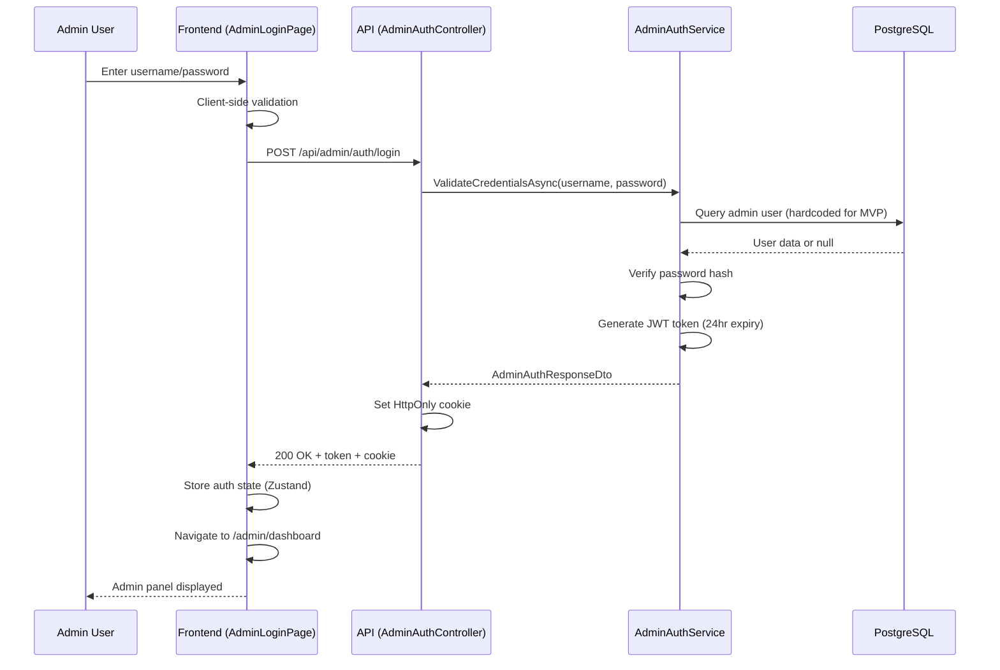
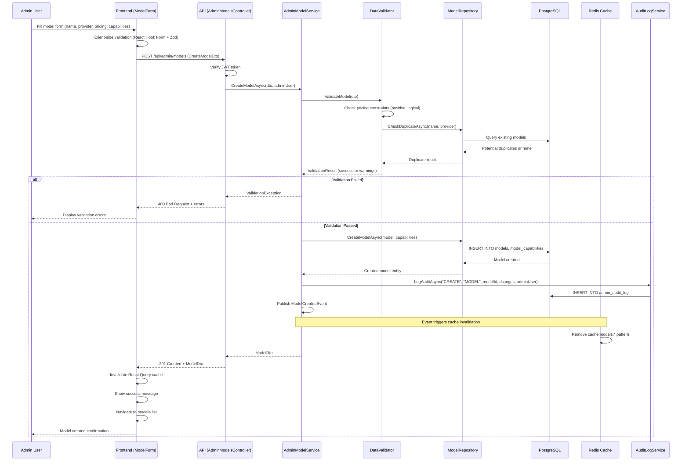
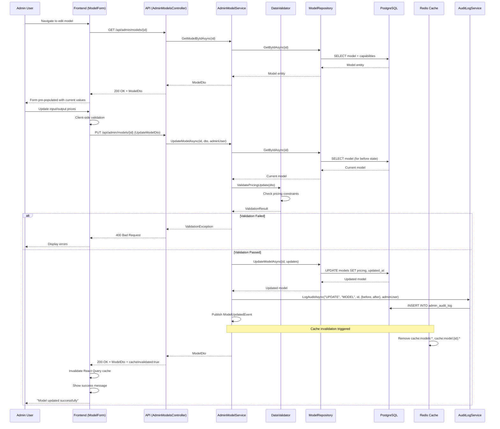
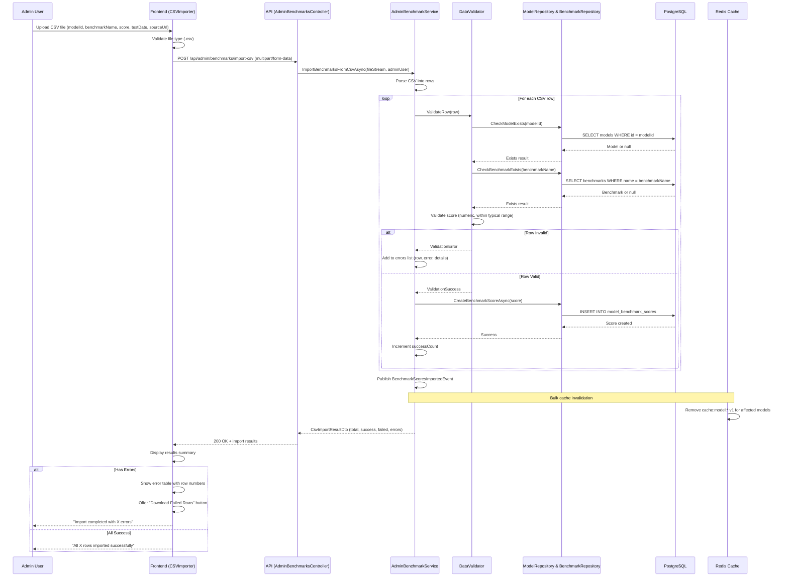

# Technical Specification: Epic 2 - Model Data Management & Admin CRUD

Date: 2025-10-17
Author: Pablo (Generated by BMad Method tech-spec workflow)
Epic ID: 2
Status: **COMPLETE** ✅
Validation: All checklist items verified

---

## Overview

Epic 2 delivers the administrative backbone of the LLM Cost Comparison Platform by implementing a secure, user-friendly admin panel for comprehensive model data management. This epic transforms the platform from a static data display (Epic 1 foundation) into a dynamic, maintainable system where administrators can create, update, and delete LLM models without requiring database access or code deployments.

The admin panel provides full CRUD (Create, Read, Update, Delete) operations for three primary data domains: **Models** (LLM specifications and pricing), **Capabilities** (technical features like function calling, vision support, context window), and **Benchmarks** (performance scores across standardized tests). By implementing JWT-based authentication, form validation, bulk operations, and CSV import capabilities, this epic ensures that platform data remains accurate, current, and manageable as the LLM landscape evolves.

**Context from PRD:** This epic directly addresses Functional Requirements FR018-FR027, enabling administrators to maintain pricing accuracy (NFR003: 95%+ accuracy) and data freshness through intuitive CRUD interfaces rather than manual database edits. The admin panel is critical for achieving the platform's goal of reducing model research time from 3-5 hours to <15 minutes by ensuring users always access current, validated data.

## Objectives and Scope

### Objectives

1. **Enable Self-Service Data Management:** Eliminate dependency on developers for model updates by providing administrators with intuitive CRUD interfaces for all data entities (models, capabilities, benchmarks).

2. **Ensure Data Quality:** Implement validation workflows that prevent invalid data entry (negative prices, out-of-range benchmark scores) while flagging anomalies for admin review.

3. **Maintain Pricing Accuracy:** Provide timestamp tracking and freshness indicators so administrators can identify stale data requiring updates, supporting NFR003 (95%+ pricing accuracy).

4. **Scale Data Entry:** Support bulk operations and CSV import to efficiently onboard new models (10+ at a time) as the LLM market expands from current 50+ to 100+ models.

5. **Secure Administrative Access:** Implement JWT authentication with HttpOnly cookies to protect admin endpoints while maintaining simplicity for the 1-3 admin users in MVP scope.

### In-Scope

**Core Admin CRUD:**
- Model management: Create, read, update, soft-delete models with full metadata (name, provider, version, release date, status, pricing)
- Capability management: Integrated capability editing within model forms (context window, max output tokens, binary capability flags)
- Benchmark management: Benchmark definition CRUD + score entry per model with validation against expected ranges
- Bulk operations: Multi-model status updates, batch pricing changes
- CSV import: Bulk benchmark score import with validation and error reporting

**Authentication & Security:**
- Simple JWT authentication for admin panel (/admin/* routes)
- Login/logout functionality with session management
- Admin user identification for audit trails

**Data Quality Features:**
- Form validation (client + server): Pricing constraints, benchmark range checks, required fields
- Timestamp tracking: created_at, updated_at for all entities
- Duplicate detection: Warn when creating models with similar name+provider combinations
- Audit logging: Track all create/update/delete operations with before/after values

**User Experience:**
- Responsive admin layout with sidebar navigation
- Search and filter capabilities in model list views
- Confirmation dialogs for destructive operations (delete, bulk updates)
- Success/error messaging with actionable feedback
- Dashboard with data quality metrics (stale models, incomplete benchmarks)

### Out-of-Scope

**Deferred to Later Epics:**
- Public-facing comparison table (Epic 3)
- Cost calculator functionality (Epic 4)
- Smart filters and QAPS algorithm (Epic 6)
- Advanced data quality automation (Epic 7: automated anomaly detection, scheduled freshness checks)
- Responsive mobile optimization (Epic 8)

**Post-MVP Features:**
- Multi-admin role-based access control (single admin role for MVP)
- Multi-factor authentication (simple JWT sufficient for MVP)
- Advanced audit log filtering and export
- Automated price scraping integration (Phase 2)
- Historical pricing tracking (Phase 2 with TimescaleDB)
- Admin analytics dashboard (page views, most-compared models)
- Email notifications for stale data

**Explicitly Excluded:**
- User account management for public users (no user accounts in MVP)
- Social login or OAuth integration
- Real-time collaboration features (concurrent editing)
- Advanced permissions (editor vs. viewer roles)

## System Architecture Alignment

Epic 2 extends the **Hexagonal Architecture** foundation established in Epic 1, adding the administrative use case layer while maintaining strict architectural boundaries:

### Architectural Integration

**Application Layer (New Services):**
- `AdminModelService`: Orchestrates model CRUD operations, coordinates validation and cache invalidation
- `AdminBenchmarkService`: Manages benchmark definitions and score entry workflows
- `AdminAuthService`: Handles JWT token generation/validation and admin session management
- `DataQualityService`: Computes data quality metrics (completeness, freshness, validation status) for admin dashboard
- `AuditLogService`: Records all administrative actions for compliance and troubleshooting

**Domain Layer (Extensions):**
- `DataValidator` domain service: Centralizes validation rules (pricing constraints, benchmark ranges, duplicate detection)
- `AuditLog` entity: Captures admin actions with before/after state for traceability
- No changes to existing domain entities (Model, Capability, Benchmark, BenchmarkScore)—Epic 1 schema remains intact

**Infrastructure Layer (New Adapters):**
- `AdminModelRepository`: Extends `IModelRepository` with admin-specific queries (search, filter, soft-delete)
- `AuditLogRepository`: Implements `IAuditLogRepository` for audit trail persistence
- Cache invalidation hooks: Admin updates trigger domain events → Redis cache patterns busted (`cache:models:*`, `cache:model:{id}:*`)

**Presentation Layer (New Admin Panel):**
- React admin interface (`/admin/*` routes) with dedicated layout component
- Admin-specific React Query hooks (`useAdminModels`, `useAdminAuth`, `useAdminDashboard`)
- Zustand store for admin session state (authenticated user, permissions)
- Reuses existing UI components (Button, Modal, Input) from design system established in Epic 1

### Constraint Adherence

**Hexagonal Architecture Boundaries:**
- ✅ Domain layer remains pure: No ASP.NET, EF Core, or React dependencies in `AdminModelService` business logic
- ✅ Validation logic centralized in domain layer (`DataValidator`), reused by both API endpoints and frontend
- ✅ Repository abstractions (`IAdminModelRepository`) enable future adapter swaps (e.g., MongoDB replacement) without domain changes
- ✅ Admin services testable without HTTP infrastructure: Unit tests mock `IModelRepository`, no WebApplicationFactory needed

**Dependency Flow:**
```
AdminController (API) → AdminModelService (Application) → DataValidator (Domain) → IModelRepository (Port) → ModelRepository (Infrastructure)
AdminLayout (React) → useAdminModels (Hook) → axios (HTTP) → AdminController
```

**Database Schema Alignment:**
- Reuses Epic 1 tables: `models`, `model_capabilities`, `benchmarks`, `model_benchmark_scores`
- Adds 1 new table: `admin_audit_log` (tracks CRUD operations)
- No schema migrations for existing tables—Epic 2 operates on existing foundation

**Caching Strategy:**
- Admin mutations (POST/PUT/DELETE) invalidate public API caches via domain events:
  - Create/Update/Delete model → Bust `cache:models:list:v1`, `cache:model:{id}:v1`
  - Add benchmark score → Bust `cache:model:{id}:v1`, `cache:bestvalue:v1` (future Epic 6)
- Admin panel itself **not cached** (always fresh data for administrators)
- Cache invalidation handled by `CacheInvalidationHandler` (domain event subscriber)

**Security Alignment:**
- JWT authentication aligns with ADR-008 (Simple JWT for Admin Authentication)
- Admin endpoints secured via `[Authorize]` attribute + JWT middleware
- Public API remains unauthenticated (read-only), admin API requires valid token
- HttpOnly cookies prevent XSS attacks, SameSite=Strict prevents CSRF (ADR-005 security patterns)

### Integration Points

**With Epic 1 Foundation:**
- Extends existing `ModelsController` with admin-specific POST/PUT/DELETE endpoints (`/api/admin/models/*`)
- Reuses `AppDbContext` and repository pattern established in Story 1.3-1.4
- Leverages CI/CD pipeline from Story 1.8 for automated admin panel testing

**With Future Epics:**
- **Epic 3 (Public Table):** Admin updates immediately reflect in public comparison table via cache invalidation
- **Epic 6 (QAPS Algorithm):** Admin benchmark score changes trigger QAPS recalculation and cache refresh
- **Epic 7 (Data Quality):** Audit log and validation infrastructure established here will be extended with automated quality checks

## Detailed Design

### Services and Modules

| Service/Module | Layer | Responsibilities | Inputs | Outputs | Owner |
|----------------|-------|------------------|--------|---------|-------|
| **AdminAuthService** | Application | JWT token generation, validation, admin session management | Login credentials (username, password) | JWT token, admin user info | Backend |
| **AdminModelService** | Application | Orchestrates model CRUD operations, coordinates validation, cache invalidation | CreateModelDto, UpdateModelDto, model ID | ModelDto, operation result | Backend |
| **AdminBenchmarkService** | Application | Manages benchmark definitions and score entry workflows | CreateBenchmarkDto, BenchmarkScoreDto | BenchmarkDto, validation results | Backend |
| **DataQualityService** | Application | Computes data quality metrics (completeness, freshness, validation status) | Database query context | Dashboard metrics (stale count, incomplete count, quality score) | Backend |
| **AuditLogService** | Application | Records all administrative actions with before/after state | Admin action event (entity, changes, user) | Audit log entry | Backend |
| **DataValidator** | Domain | Centralizes validation rules (pricing, benchmarks, duplicates) | Entity to validate, validation context | Validation result (success/failure + errors) | Backend |
| **AdminModelRepository** | Infrastructure | Extends IModelRepository with admin-specific queries (search, filter, soft-delete) | Search criteria, filter params | List<Model>, pagination info | Backend |
| **AuditLogRepository** | Infrastructure | Implements IAuditLogRepository for audit trail persistence | AuditLog entity | Persisted audit log | Backend |
| **CacheInvalidationHandler** | Infrastructure | Handles domain events to bust Redis cache patterns | Domain event (ModelUpdated, BenchmarkScoreAdded) | Cache invalidation result | Backend |
| **AdminLayout** | Presentation | React admin panel layout with sidebar navigation, auth routing | Admin session state | Rendered admin interface | Frontend |
| **ModelForm** | Presentation | React form component for model creation/editing with validation | Model entity (edit mode) or null (create mode) | Form submission (CreateModelDto/UpdateModelDto) | Frontend |
| **BenchmarkForm** | Presentation | React form for benchmark definitions and score entry | Benchmark entity or null | Form submission (CreateBenchmarkDto) | Frontend |
| **CSVImporter** | Presentation | React component for bulk benchmark import with error reporting | CSV file upload | Import results (success/failure counts, error details) | Frontend |
| **AdminDashboard** | Presentation | React dashboard displaying data quality metrics | Dashboard metrics from API | Rendered metrics, quick actions | Frontend |
| **useAdminModels** | Presentation | React Query hook for admin model data fetching/mutations | Query params (search, filter) | Models data, loading state, mutation functions | Frontend |
| **useAdminAuth** | Presentation | React hook for authentication state management | Login credentials | Auth state (token, user, login/logout functions) | Frontend |

### Data Models and Contracts

#### C# Backend DTOs

```csharp
// Admin Authentication
public record AdminLoginDto(
    string Username,
    string Password
);

public record AdminAuthResponseDto(
    string Token,
    string Username,
    DateTime ExpiresAt
);

// Model Management
public record CreateModelDto(
    string Name,
    string Provider,
    string? Version,
    DateTime? ReleaseDate,
    string Status, // "active" | "deprecated" | "beta"
    decimal InputPricePer1M,
    decimal OutputPricePer1M,
    string Currency,
    DateTime? PricingValidFrom,
    DateTime? PricingValidTo,
    CreateCapabilityDto Capabilities
);

public record UpdateModelDto(
    string? Name,
    string? Provider,
    string? Version,
    DateTime? ReleaseDate,
    string? Status,
    decimal? InputPricePer1M,
    decimal? OutputPricePer1M,
    string? Currency,
    DateTime? PricingValidFrom,
    DateTime? PricingValidTo,
    UpdateCapabilityDto? Capabilities
);

public record CreateCapabilityDto(
    int ContextWindow,
    int? MaxOutputTokens,
    bool SupportsFunctionCalling,
    bool SupportsVision,
    bool SupportsAudioInput,
    bool SupportsAudioOutput,
    bool SupportsStreaming,
    bool SupportsJsonMode
);

public record UpdateCapabilityDto(
    int? ContextWindow,
    int? MaxOutputTokens,
    bool? SupportsFunctionCalling,
    bool? SupportsVision,
    bool? SupportsAudioInput,
    bool? SupportsAudioOutput,
    bool? SupportsStreaming,
    bool? SupportsJsonMode
);

// Benchmark Management
public record CreateBenchmarkDto(
    string BenchmarkName,
    string? FullName,
    string? Description,
    string Category, // "reasoning" | "code" | "math" | "language" | "multimodal"
    string Interpretation, // "higher_better" | "lower_better"
    decimal? TypicalRangeMin,
    decimal? TypicalRangeMax,
    decimal? WeightInQAPS
);

public record BenchmarkScoreDto(
    Guid ModelId,
    Guid BenchmarkId,
    decimal Score,
    decimal? MaxScore,
    DateTime? TestDate,
    string? SourceUrl,
    string? Notes
);

// Bulk Operations
public record BulkUpdateModelsDto(
    List<Guid> ModelIds,
    string? Status,
    string? Currency
);

// CSV Import
public record CsvImportResultDto(
    int TotalRows,
    int SuccessfulImports,
    int FailedImports,
    List<CsvImportErrorDto> Errors
);

public record CsvImportErrorDto(
    int Row,
    string Error,
    Dictionary<string, object>? Details
);

// Dashboard Metrics
public record AdminDashboardMetricsDto(
    int TotalModels,
    int ModelsNeedingUpdate,
    int ModelsWithIncompleteBenchmarks,
    int RecentAdditions,
    decimal DataQualityScore,
    List<ModelSummaryDto> StaleModels
);

public record ModelSummaryDto(
    Guid Id,
    string Name,
    string Provider,
    DateTime UpdatedAt,
    int DaysSinceUpdate
);

// Audit Log
public record AuditLogDto(
    Guid Id,
    string AdminUser,
    string Action, // "CREATE" | "UPDATE" | "DELETE" | "BULK_UPDATE"
    string EntityType, // "MODEL" | "BENCHMARK" | "SCORE"
    Guid? EntityId,
    object? ChangesBefore,
    object? ChangesAfter,
    DateTime CreatedAt
);
```

#### Domain Entity Extensions

```csharp
// New entity for Epic 2
namespace LlmTokenPrice.Domain.Entities;

public class AuditLog
{
    public Guid Id { get; init; }
    public string AdminUser { get; set; } = string.Empty;
    public string Action { get; set; } = string.Empty;
    public string EntityType { get; set; } = string.Empty;
    public Guid? EntityId { get; set; }
    public string ChangesJson { get; set; } = "{}"; // JSONB in PostgreSQL
    public string? IpAddress { get; set; }
    public string? UserAgent { get; set; }
    public DateTime CreatedAt { get; init; } = DateTime.UtcNow;
}
```

#### TypeScript Frontend Types

```typescript
// Admin Authentication
export interface AdminLoginRequest {
  username: string;
  password: string;
}

export interface AdminAuthResponse {
  token: string;
  username: string;
  expiresAt: string; // ISO 8601
}

// Model Management
export interface CreateModelRequest {
  name: string;
  provider: string;
  version?: string;
  releaseDate?: string;
  status: 'active' | 'deprecated' | 'beta';
  inputPricePer1M: number;
  outputPricePer1M: number;
  currency: string;
  pricingValidFrom?: string;
  pricingValidTo?: string;
  capabilities: CreateCapabilityRequest;
}

export interface UpdateModelRequest {
  name?: string;
  provider?: string;
  version?: string;
  releaseDate?: string;
  status?: 'active' | 'deprecated' | 'beta';
  inputPricePer1M?: number;
  outputPricePer1M?: number;
  currency?: string;
  pricingValidFrom?: string;
  pricingValidTo?: string;
  capabilities?: UpdateCapabilityRequest;
}

export interface CreateCapabilityRequest {
  contextWindow: number;
  maxOutputTokens?: number;
  supportsFunctionCalling: boolean;
  supportsVision: boolean;
  supportsAudioInput: boolean;
  supportsAudioOutput: boolean;
  supportsStreaming: boolean;
  supportsJsonMode: boolean;
}

// Benchmark Management
export interface CreateBenchmarkRequest {
  benchmarkName: string;
  fullName?: string;
  description?: string;
  category: 'reasoning' | 'code' | 'math' | 'language' | 'multimodal';
  interpretation: 'higher_better' | 'lower_better';
  typicalRangeMin?: number;
  typicalRangeMax?: number;
  weightInQAPS?: number;
}

export interface BenchmarkScoreRequest {
  modelId: string;
  benchmarkId: string;
  score: number;
  maxScore?: number;
  testDate?: string;
  sourceUrl?: string;
  notes?: string;
}

// Dashboard Metrics
export interface AdminDashboardMetrics {
  totalModels: number;
  modelsNeedingUpdate: number;
  modelsWithIncompleteBenchmarks: number;
  recentAdditions: number;
  dataQualityScore: number;
  staleModels: ModelSummary[];
}

export interface ModelSummary {
  id: string;
  name: string;
  provider: string;
  updatedAt: string;
  daysSinceUpdate: number;
}

// CSV Import
export interface CsvImportResult {
  totalRows: number;
  successfulImports: number;
  failedImports: number;
  errors: CsvImportError[];
}

export interface CsvImportError {
  row: number;
  error: string;
  details?: Record<string, any>;
}
```

#### Database Schema Additions

```sql
-- New table for Epic 2
CREATE TABLE admin_audit_log (
  id UUID PRIMARY KEY DEFAULT gen_random_uuid(),
  admin_user VARCHAR(100) NOT NULL,
  action VARCHAR(50) NOT NULL,        -- CREATE|UPDATE|DELETE|BULK_UPDATE
  entity_type VARCHAR(50) NOT NULL,   -- MODEL|BENCHMARK|SCORE
  entity_id UUID,
  changes_json JSONB,                 -- {before: {...}, after: {...}}
  ip_address INET,
  user_agent TEXT,
  created_at TIMESTAMP DEFAULT now()
);

CREATE INDEX idx_audit_log_user ON admin_audit_log(admin_user);
CREATE INDEX idx_audit_log_entity ON admin_audit_log(entity_type, entity_id);
CREATE INDEX idx_audit_log_created ON admin_audit_log(created_at DESC);
```

### APIs and Interfaces

#### Admin Authentication Endpoints

```
POST /api/admin/auth/login
Request Body: AdminLoginDto
Response: 200 OK + AdminAuthResponseDto (JWT token in response body + HttpOnly cookie)
Error Codes: 401 Unauthorized (invalid credentials), 400 Bad Request (validation)
```

```
POST /api/admin/auth/logout
Authorization: Bearer {token}
Response: 200 OK
Error Codes: 401 Unauthorized
```

#### Admin Model Management Endpoints

```
GET /api/admin/models
Authorization: Bearer {token}
Query Params: search (string), provider (string), status (string), page (int), limit (int)
Response: 200 OK + { data: ModelDto[], meta: { total, page, limit } }
Caching: Not cached (admin always sees fresh data)
Error Codes: 401 Unauthorized, 500 Internal Server Error
```

```
GET /api/admin/models/{id}
Authorization: Bearer {token}
Response: 200 OK + ModelDto (with full capabilities and benchmark scores)
Error Codes: 401 Unauthorized, 404 Not Found
```

```
POST /api/admin/models
Authorization: Bearer {token}
Request Body: CreateModelDto
Response: 201 Created + { data: ModelDto, meta: { message: "Model created successfully" } }
Side Effects: Cache invalidation (cache:models:*), Audit log entry
Error Codes: 401 Unauthorized, 400 Bad Request (validation), 409 Conflict (duplicate)
```

```
PUT /api/admin/models/{id}
Authorization: Bearer {token}
Request Body: UpdateModelDto
Response: 200 OK + { data: ModelDto, meta: { message: "Model updated", cacheInvalidated: true } }
Side Effects: Cache invalidation (cache:models:*, cache:model:{id}:*), Audit log entry
Error Codes: 401 Unauthorized, 404 Not Found, 400 Bad Request (validation)
```

```
DELETE /api/admin/models/{id}
Authorization: Bearer {token}
Response: 200 OK + { meta: { message: "Model deleted" } }
Implementation: Soft delete (sets is_active=false) to preserve audit trail
Side Effects: Cache invalidation, Audit log entry
Error Codes: 401 Unauthorized, 404 Not Found
```

```
POST /api/admin/models/bulk-update
Authorization: Bearer {token}
Request Body: BulkUpdateModelsDto
Response: 200 OK + { data: { updated: 5, failed: 0 }, meta: { message: "Bulk update completed" } }
Side Effects: Multiple cache invalidations, Bulk audit log entries
Error Codes: 401 Unauthorized, 400 Bad Request
```

#### Admin Benchmark Management Endpoints

```
GET /api/admin/benchmarks
Authorization: Bearer {token}
Response: 200 OK + { data: BenchmarkDto[] }
```

```
POST /api/admin/benchmarks
Authorization: Bearer {token}
Request Body: CreateBenchmarkDto
Response: 201 Created + BenchmarkDto
Error Codes: 401 Unauthorized, 400 Bad Request (validation), 409 Conflict (duplicate name)
```

```
PUT /api/admin/benchmarks/{id}
Authorization: Bearer {token}
Request Body: UpdateBenchmarkDto
Response: 200 OK + BenchmarkDto
Error Codes: 401 Unauthorized, 404 Not Found, 400 Bad Request
```

```
DELETE /api/admin/benchmarks/{id}
Authorization: Bearer {token}
Response: 200 OK
Warning: Cascade deletes all benchmark scores for this benchmark (requires confirmation)
Error Codes: 401 Unauthorized, 404 Not Found
```

```
POST /api/admin/models/{modelId}/benchmarks
Authorization: Bearer {token}
Request Body: BenchmarkScoreDto
Response: 201 Created + { data: BenchmarkScoreDto, meta: { validated: true } }
Validation: Score within typical_range_min/max (warning if outside, allows override)
Side Effects: Cache invalidation (cache:model:{id}:*, cache:bestvalue:*), Audit log
Error Codes: 401 Unauthorized, 404 Not Found (model or benchmark), 400 Bad Request
```

```
POST /api/admin/benchmarks/import-csv
Authorization: Bearer {token}
Content-Type: multipart/form-data
Request Body: file (CSV)
Response: 200 OK + CsvImportResultDto
CSV Format: modelId, benchmarkName, score, testDate (optional), sourceUrl (optional)
Processing: Validates each row, imports valid, collects errors for failed rows
Error Codes: 401 Unauthorized, 400 Bad Request (invalid CSV format)
```

#### Admin Dashboard Endpoints

```
GET /api/admin/dashboard/metrics
Authorization: Bearer {token}
Response: 200 OK + AdminDashboardMetricsDto
Computes:
  - Total models count
  - Models >7 days old (stale)
  - Models with <3 benchmarks (incomplete)
  - Recent additions (last 7 days)
  - Data quality score: (complete + fresh) / total * 100
Error Codes: 401 Unauthorized
```

```
GET /api/admin/audit-log
Authorization: Bearer {token}
Query Params: user (string), action (string), entityType (string), from (date), to (date), page, limit
Response: 200 OK + { data: AuditLogDto[], meta: { total, page, limit } }
Error Codes: 401 Unauthorized
```

#### Cache Invalidation Patterns

Admin mutations trigger cache invalidation via domain events:

```csharp
// Example: Model created/updated
public class ModelUpdatedEvent : IDomainEvent
{
    public Guid ModelId { get; init; }
    public string Action { get; init; } // "CREATE" | "UPDATE" | "DELETE"
}

// Cache invalidation handler
public class CacheInvalidationHandler : INotificationHandler<ModelUpdatedEvent>
{
    public async Task Handle(ModelUpdatedEvent evt, CancellationToken ct)
    {
        // Invalidate list caches
        await _cache.RemovePatternAsync("cache:models:*");

        // Invalidate specific model cache
        await _cache.RemoveAsync($"cache:model:{evt.ModelId}:v1");

        // Invalidate best value cache (for Epic 6)
        await _cache.RemovePatternAsync("cache:bestvalue:*");
    }
}
```

### Workflows and Sequencing

#### Workflow 1: Admin Login



**Success Path:** User authenticated → JWT token generated → HttpOnly cookie set → Redirect to dashboard
**Error Path:** Invalid credentials → 401 Unauthorized → Display error message → Stay on login page

---

#### Workflow 2: Create New Model



**Success Path:** Validation passed → Model created in DB → Audit logged → Cache invalidated → Success message
**Error Paths:**
- Validation failed → 400 Bad Request → Display errors
- Duplicate detected → Warning shown, user confirms or cancels
- Database error → 500 Internal Server Error → Display generic error

---

#### Workflow 3: Update Model Pricing



**Success Path:** Validation passed → Model updated → Audit logged → Cache busted → Public API reflects changes immediately
**Key Feature:** Audit log captures before/after state for pricing changes (compliance requirement)

---

#### Workflow 4: Bulk Benchmark Import via CSV



**Success Path:** All rows valid → Imported to DB → Bulk cache invalidation → Success summary
**Partial Success Path:** Some rows invalid → Valid rows imported, invalid collected → Error report with download option
**Key Features:** Row-by-row validation, atomic per-row insertion, detailed error reporting for troubleshooting

## Non-Functional Requirements

### Performance

**Admin Panel Load Time:**
- Initial admin login page load: <1 second
- Admin dashboard load (with metrics computation): <2 seconds
- Models list view (50+ models with search/filter): <1.5 seconds
- Model detail page load: <800ms

**Form Interactions:**
- Form validation (client-side): <50ms instant feedback
- Form submission response: <500ms for create/update operations
- Bulk operations (10 models): <2 seconds
- CSV import (100 rows): <5 seconds

**Cache Invalidation Performance:**
- Cache bust operation: <100ms (asynchronous, doesn't block API response)
- Pattern-based cache removal (`cache:models:*`): <200ms for 10-20 keys
- Public API reflects admin changes: Within 1 second of cache invalidation

**Database Query Performance:**
- Admin model list query (paginated): <200ms
- Duplicate detection query: <100ms
- Audit log query (last 30 days, paginated): <300ms
- Dashboard metrics computation: <500ms (aggregates stale/incomplete counts)

**Targets:**
- Admin panel should feel "instant" for all CRUD operations
- No loading spinners >2 seconds for any admin operation
- Background cache invalidation prevents admin from experiencing delay
- Pagination ensures list views remain fast with 100+ models

**Performance Testing:**
- Load test admin endpoints with 5 concurrent admins (realistic max)
- Verify bulk operations scale linearly (10 vs 100 models)
- Test CSV import with 1000 rows (should complete in <30s)

### Security

**Authentication & Authorization:**
- JWT tokens stored in HttpOnly cookies (prevents XSS access)
- Token expiration: 24 hours (configurable)
- SameSite=Strict cookie attribute (prevents CSRF attacks)
- Refresh token mechanism: Deferred to post-MVP (manual re-login acceptable)
- All admin endpoints require `[Authorize]` attribute with JWT validation
- Invalid/expired tokens return 401 Unauthorized immediately

**Password Security (MVP Hardcoded Credentials):**
- Admin credentials stored as environment variables (not in code)
- Password hashed with bcrypt (cost factor 12) before comparison
- No plaintext passwords in logs, error messages, or audit trail
- Production deployment requires credential rotation

**Input Validation:**
- Defense in depth: Client-side (Zod) + Server-side (FluentValidation) + Database constraints
- All user input sanitized before database queries (EF Core parameterizes automatically)
- File upload validation: CSV only, max 5MB file size, content-type verification
- SQL injection prevented via EF Core parameterized queries (no raw SQL)

**XSS Prevention:**
- React escapes all user input by default
- No use of `dangerouslySetInnerHTML` in admin panel
- Content-Security-Policy headers configured in production

**CSRF Prevention:**
- SameSite=Strict cookies block cross-site requests
- Anti-forgery tokens for state-changing operations (ASP.NET Core built-in)
- Admin panel hosted on same domain as API (no CORS issues)

**Data Access Control:**
- Soft delete preserves audit trail (deleted models still in database, hidden via `is_active=false`)
- Audit log immutable (no update/delete endpoints)
- Database permissions: Admin service account has INSERT/UPDATE/DELETE, public API account has SELECT only (future)

**Sensitive Data Handling:**
- JWT secret key stored in environment variables, rotated regularly
- Audit log does NOT capture password fields or JWT tokens (only entity changes)
- IP address and User-Agent logged for forensics but not exposed in public endpoints

**Production Security Checklist:**
- [ ] HTTPS enforced (redirect HTTP → HTTPS)
- [ ] Admin credentials rotated from defaults
- [ ] JWT secret key generated with cryptographically secure random
- [ ] Rate limiting on login endpoint (5 attempts per minute per IP)
- [ ] Security headers configured (HSTS, X-Frame-Options, X-Content-Type-Options)
- [ ] Error messages don't leak sensitive information (generic "An error occurred")

### Reliability/Availability

**Admin Panel Availability:**
- Target: 99% uptime during business hours (8am-8pm EST)
- Admin downtime acceptable during off-hours for maintenance
- Critical path: Admin login → model updates → cache invalidation → public API refresh

**Error Handling & Recovery:**
- Database connection failures: Retry 3 times with exponential backoff (100ms, 200ms, 400ms)
- Cache invalidation failures: Log error but allow operation to complete (eventual consistency acceptable)
- CSV import partial failures: Import valid rows, collect and report failed rows (atomic per-row)
- Duplicate detection: Non-blocking warning, admin can override and proceed

**Graceful Degradation:**
- If Redis unavailable: Admin operations proceed, cache invalidation skipped (public API serves stale data until Redis recovers)
- If audit log fails: Log error to Serilog, allow operation to complete (audit gap acceptable over blocking admin)
- If dashboard metrics slow: Show cached metrics (5 min TTL), display "last updated" timestamp

**Data Integrity:**
- Transactional updates: Model + Capability updates wrapped in EF Core transaction (all-or-nothing)
- Soft delete preserves referential integrity (benchmark scores remain linked to deleted models)
- Unique constraints: Database enforces model name+provider uniqueness (prevents race conditions)
- Optimistic concurrency: EF Core RowVersion/Timestamp detects concurrent updates (return 409 Conflict)

**Backup & Recovery:**
- Database backups: Daily automated backups (retention: 30 days)
- Audit log retention: Indefinite (critical for compliance)
- Admin can export all data as JSON backup (Story 7.10)
- Recovery time objective (RTO): 4 hours (acceptable for admin panel)
- Recovery point objective (RPO): 24 hours (daily backups)

**Failover Strategy (Future):**
- MVP: Single database instance (acceptable risk for admin panel)
- Post-MVP: PostgreSQL read replicas for public API, primary for admin writes
- Redis failover: Upstash automatic failover (if using managed service)

**Monitoring & Alerting:**
- Admin endpoint error rate >5%: Alert via logging
- Database connection failures >3 in 5 min: Alert
- JWT token expiration errors spike: May indicate clock skew issue
- Audit log table growth >10GB: Review retention policy

### Observability

**Structured Logging (Serilog):**
- All admin operations logged with structured context:
  ```csharp
  Log.Information("Admin {AdminUser} created model {@Model}",
      adminUser, new { model.Id, model.Name, model.Provider });
  ```
- Log levels: Information (success), Warning (validation warnings), Error (exceptions)
- Sensitive fields excluded: Passwords, JWT tokens, full audit change JSON (too verbose)

**Log Enrichment:**
- Request context: HTTP method, path, status code, duration
- Admin context: Username, IP address, User-Agent (from JWT claims)
- Correlation ID: Unique per request for distributed tracing
- Timestamp: UTC (consistent across timezones)

**Key Logged Events:**
- Admin authentication: Login success/failure, logout, token expiration
- CRUD operations: Create model (with model ID), Update model (with changed fields summary), Delete model
- Validation failures: Field name, error message, submitted value (sanitized)
- Cache invalidation: Pattern busted, keys removed count
- CSV import: Total rows, success count, failure count, error summary
- Audit log writes: Entity type, action, entity ID

**Metrics (Future - Post-MVP):**
- Admin operation latency: P50, P95, P99 for each endpoint
- Admin active sessions: Count of valid JWT tokens
- Validation failure rate: % of form submissions rejected
- Cache invalidation lag: Time from admin update to cache bust completion
- CSV import throughput: Rows processed per second

**Error Tracking:**
- Unhandled exceptions: Logged with full stack trace + request context
- Validation errors: Logged at Warning level (expected failures)
- Database errors: Logged with SQL operation type (SELECT/INSERT/UPDATE)
- Cache errors: Logged but don't block operations (eventual consistency)

**Dashboard Observability (Built-in):**
- Admin dashboard shows data quality metrics: stale models count, incomplete benchmarks
- Audit log paginated view: Recent admin actions for self-service troubleshooting
- CSV import results: Inline error reporting for failed rows

**Alerting Targets (Future):**
- Admin login failures >10 in 5 min: Potential brute force attack
- Validation failure rate >30%: May indicate UI/API contract mismatch
- Database connection errors: Critical infrastructure issue
- Audit log write failures: Compliance risk

**Log Retention:**
- Development: Console + File (7 days rolling)
- Production: Serilog → Seq/CloudWatch/Datadog (30 days retention)
- Audit log: PostgreSQL table (indefinite retention, review annually)

## Dependencies and Integrations

### Backend Dependencies

| Dependency | Version | Purpose | Installation |
|------------|---------|---------|--------------|
| **ASP.NET Core** | 9.0 | Web API framework, routing, middleware | Part of .NET 9 SDK |
| **Entity Framework Core** | 9.0.10 | ORM for PostgreSQL database access | `dotnet add package Microsoft.EntityFrameworkCore` |
| **Npgsql.EntityFrameworkCore.PostgreSQL** | 9.0.0 | PostgreSQL provider for EF Core | `dotnet add package Npgsql.EntityFrameworkCore.PostgreSQL` |
| **StackExchange.Redis** | 2.8.16 | Redis client for cache operations | `dotnet add package StackExchange.Redis` |
| **FluentValidation** | 11.11.0 | Server-side validation library | `dotnet add package FluentValidation.AspNetCore` |
| **BCrypt.Net-Next** | 4.0.3 | Password hashing for admin credentials | `dotnet add package BCrypt.Net-Next` |
| **System.IdentityModel.Tokens.Jwt** | 8.2.1 | JWT token generation/validation | `dotnet add package System.IdentityModel.Tokens.Jwt` |
| **CsvHelper** | 33.0.1 | CSV parsing for bulk import | `dotnet add package CsvHelper` |
| **Serilog.AspNetCore** | 8.0.3 | Structured logging | `dotnet add package Serilog.AspNetCore` |
| **Swashbuckle.AspNetCore** | 7.2.0 | Swagger/OpenAPI documentation | Already in Epic 1 |
| **MediatR** | 12.4.1 | Domain event handling for cache invalidation | `dotnet add package MediatR` |

### Frontend Dependencies

| Dependency | Version | Purpose | Installation |
|------------|---------|---------|--------------|
| **React** | 19.0.0 | UI framework | Already in Epic 1 |
| **React Router** | 7.1.1 | Client-side routing for admin panel | Already in Epic 1 |
| **TanStack Query** | 5.62.7 | Server state management, cache invalidation | Already in Epic 1 |
| **Zustand** | 5.0.2 | Admin session state management | Already in Epic 1 |
| **React Hook Form** | 7.54.2 | Form state management, validation | `pnpm add react-hook-form` |
| **Zod** | 3.24.1 | TypeScript-first schema validation | `pnpm add zod` |
| **axios** | 1.7.9 | HTTP client for admin API calls | Already in Epic 1 |
| **date-fns** | 4.1.0 | Date formatting for timestamps | `pnpm add date-fns` |
| **lucide-react** | 0.468.0 | Icons for admin UI | Already in Epic 1 |
| **@tanstack/react-table** | 8.20.6 | Table component for models list | Already in Epic 1 (reused) |
| **react-csv** | 2.2.2 | CSV export for failed import rows | `pnpm add react-csv` |

### Infrastructure Dependencies

**From Epic 1 (Reused):**
- PostgreSQL 16.0 (database)
- Redis 7.2 (cache)
- Docker Compose (local development)
- GitHub Actions (CI/CD)

**Environment Variables Required:**
```bash
# Backend (.NET)
DATABASE_CONNECTION_STRING="Host=localhost;Port=5434;Database=llm_token_price;..."
REDIS_CONNECTION_STRING="localhost:6379"
JWT_SECRET_KEY="<cryptographically-secure-random-key-min-32-chars>"
JWT_EXPIRATION_HOURS="24"
ADMIN_USERNAME="admin"  # MVP only, stored in environment
ADMIN_PASSWORD_HASH="<bcrypt-hash>"  # Generated with BCrypt.Net

# Frontend (React)
VITE_API_BASE_URL="http://localhost:5000"  # Dev
VITE_API_BASE_URL="https://api.production.com"  # Prod
```

### External Service Integrations

**None for Epic 2 MVP**

Epic 2 operates entirely within the existing infrastructure established in Epic 1:
- No external API calls
- No third-party authentication providers (OAuth deferred)
- No email services (notifications deferred)
- No payment processors (not applicable)
- No analytics services (deferred to Epic 7)

### Integration with Other Epics

**Depends On:**
- **Epic 1 (Foundation):** Database schema, repository pattern, API structure, CI/CD pipeline
- Must be completed before Epic 2 begins

**Consumed By:**
- **Epic 3 (Public Table):** Admin updates immediately reflected in public comparison table via cache invalidation
- **Epic 6 (QAPS Algorithm):** Admin benchmark score changes trigger QAPS recalculation
- **Epic 7 (Data Quality):** Audit log and validation infrastructure extended with automated checks

**Integration Points:**
1. **Cache Invalidation:** Admin mutations publish domain events → `CacheInvalidationHandler` subscribes → Redis patterns busted → Public API serves fresh data
2. **Repository Sharing:** Admin uses same `IModelRepository` interface as public API (different implementation methods: admin has write access)
3. **DTO Reuse:** Admin endpoints return same `ModelDto` used by public API (single source of truth)

### Deployment Dependencies

**Database Migrations:**
```bash
# Apply Epic 2 migration (adds admin_audit_log table)
cd services/backend
dotnet ef migrations add Epic2_AddAdminAuditLog --project LlmTokenPrice.Infrastructure
dotnet ef database update --project LlmTokenPrice.Infrastructure
```

**Seed Admin Credentials:**
```bash
# Generate bcrypt hash for admin password
dotnet run --project LlmTokenPrice.API -- hash-password "YourSecurePassword"
# Output: $2a$12$abcdef... (store in ADMIN_PASSWORD_HASH environment variable)
```

**CI/CD Pipeline Updates:**
- Add admin endpoint tests to GitHub Actions workflow
- Environment secrets: JWT_SECRET_KEY, ADMIN_PASSWORD_HASH
- Frontend build includes admin panel routes (/admin/*)

### Version Compatibility Matrix

| Component | Version | Compatibility Notes |
|-----------|---------|---------------------|
| .NET SDK | 9.0 | Required for C# 13 features (records, init-only properties) |
| Entity Framework Core | 9.0.10 | Must match .NET version |
| PostgreSQL | 16.0+ | JSONB support for audit log changes_json column |
| Redis | 7.2+ | Pattern-based deletion for cache:models:* |
| Node.js | 22.x | Required for pnpm 10.x |
| React | 19.0.0 | New concurrent features, React Hook Form compatible |
| TypeScript | 5.7.2 | Strict mode enabled, Zod type inference |

## Acceptance Criteria (Authoritative)

This section consolidates all acceptance criteria from the 10-12 stories in Epic 2. These criteria are **authoritative** and must be verified during testing before Epic 2 is considered complete.

### Story 2.1: Admin Panel Authentication

✅ **AC 2.1.1:** Admin login page created with username/password input fields, styled consistently with platform design
✅ **AC 2.1.2:** Backend authentication endpoint `POST /api/admin/auth/login` implemented, accepts AdminLoginDto, returns AdminAuthResponseDto with JWT token
✅ **AC 2.1.3:** JWT authentication mechanism implemented with HttpOnly cookies (SameSite=Strict), 24-hour expiration
✅ **AC 2.1.4:** Admin session/token stored in Zustand store for authenticated requests, persists across page refreshes
✅ **AC 2.1.5:** Protected admin routes redirect to `/admin/login` if not authenticated (React Router loader guards)
✅ **AC 2.1.6:** Logout functionality clears session from Zustand and removes HttpOnly cookie (POST /api/admin/auth/logout)

**Test:** Manual login with valid credentials → redirected to dashboard, invalid credentials → error message displayed

---

### Story 2.2: Admin Dashboard Layout

✅ **AC 2.2.1:** Admin layout component created with responsive sidebar navigation (collapsible on mobile)
✅ **AC 2.2.2:** Navigation menu includes links: Dashboard, Models, Benchmarks (active link highlighted)
✅ **AC 2.2.3:** Main content area renders selected section component dynamically based on route
✅ **AC 2.2.4:** Header displays logged-in admin username and logout button (top-right)
✅ **AC 2.2.5:** Responsive layout works on desktop (>1024px), tablet (768-1024px), mobile (<768px)

**Test:** Navigate between admin sections → sidebar updates, content area renders correct component, layout responsive

---

### Story 2.3: Models List View in Admin Panel

✅ **AC 2.3.1:** Admin models list page at `/admin/models` displays all models in TanStack Table
✅ **AC 2.3.2:** Table columns: Name, Provider, Input Price, Output Price, Status, Last Updated (sortable)
✅ **AC 2.3.3:** Search box filters models by name or provider in real-time (debounced 300ms)
✅ **AC 2.3.4:** "Add New Model" button navigates to `/admin/models/new` (creation form)
✅ **AC 2.3.5:** "Edit" icon button on each row navigates to `/admin/models/{id}/edit`
✅ **AC 2.3.6:** "Delete" icon button triggers confirmation modal ("Are you sure?"), cancellable

**Test:** Search for "GPT" → table filters, click Edit → navigates to edit form with pre-populated data

---

### Story 2.4: Add New Model Form

✅ **AC 2.4.1:** Add model form page at `/admin/models/new` with fields: name, provider, version, release date, status dropdown, input price, output price, currency dropdown, pricing validity dates
✅ **AC 2.4.2:** Client-side validation with React Hook Form + Zod: required fields highlighted, pricing must be positive numbers
✅ **AC 2.4.3:** Form validation enforces logical constraints (e.g., pricingValidFrom < pricingValidTo)
✅ **AC 2.4.4:** "Save" button POSTs to `/api/admin/models` with CreateModelDto, disabled during submission
✅ **AC 2.4.5:** Success redirects to `/admin/models` with toast notification "Model created successfully"
✅ **AC 2.4.6:** Validation errors display inline beneath respective fields, summarized at form top

**Test:** Submit form with missing name → validation error shown, submit with valid data → model created and redirected

---

### Story 2.5: Backend API for Adding Models

✅ **AC 2.5.1:** `POST /api/admin/models` endpoint implemented, requires JWT authorization
✅ **AC 2.5.2:** Endpoint accepts CreateModelDto, validates with FluentValidation (pricing positive, required fields present)
✅ **AC 2.5.3:** Model entity created and persisted to `models` table with auto-generated `id`, `created_at`, `updated_at` timestamps
✅ **AC 2.5.4:** ModelCapabilities entity created and linked to model in `model_capabilities` table (one-to-one)
✅ **AC 2.5.5:** API returns `201 Created` with ModelDto including generated `id`
✅ **AC 2.5.6:** Validation errors return `400 Bad Request` with structured error details (field, message)

**Test:** POST with invalid data → 400 with errors, POST with valid data → 201 with model ID, verify database record

---

### Story 2.6: Capabilities Section in Model Form

✅ **AC 2.6.1:** Capabilities section added to model form (both create and edit) with collapsible panel
✅ **AC 2.6.2:** Number inputs for `contextWindow` (default 4096), `maxOutputTokens` (optional)
✅ **AC 2.6.3:** Checkboxes for: function calling, vision support, audio input, audio output, streaming, JSON mode
✅ **AC 2.6.4:** Form submission includes capabilities data nested in CreateModelDto/UpdateModelDto
✅ **AC 2.6.5:** Backend API updated to save capabilities to `model_capabilities` table (Story 2.5 extended)
✅ **AC 2.6.6:** Edit form pre-populates capability checkboxes with current model values

**Test:** Create model with capabilities → verify database `model_capabilities` record, edit model → checkboxes reflect saved state

---

### Story 2.7: Edit Model Functionality

✅ **AC 2.7.1:** Edit form at `/admin/models/{id}/edit` loads model data via `GET /api/admin/models/{id}`
✅ **AC 2.7.2:** Form fields pre-populated with current values: basic info, pricing, capabilities
✅ **AC 2.7.3:** `PUT /api/admin/models/{id}` endpoint updates model and capabilities in database
✅ **AC 2.7.4:** `updated_at` timestamp refreshed automatically on save (EF Core interceptor)
✅ **AC 2.7.5:** Success redirects to `/admin/models` with toast "Model updated successfully"
✅ **AC 2.7.6:** Audit log entry created capturing before/after state (via AuditLogService)

**Test:** Edit model pricing → verify database update, `updated_at` changed, audit log entry exists with before/after JSON

---

### Story 2.8: Delete Model Functionality

✅ **AC 2.8.1:** Delete button triggers confirmation modal with model name in message ("Delete {modelName}?")
✅ **AC 2.8.2:** `DELETE /api/admin/models/{id}` endpoint implemented (soft delete: sets `is_active=false`)
✅ **AC 2.8.3:** Soft-deleted models excluded from public API queries (`WHERE is_active=true`)
✅ **AC 2.8.4:** Associated capabilities and benchmark scores retained (referential integrity via foreign keys)
✅ **AC 2.8.5:** Success refreshes models list with toast "Model deleted", removed from table
✅ **AC 2.8.6:** Audit log records deletion with action "DELETE" (admin user, timestamp, entity ID)

**Test:** Delete model → verify `is_active=false` in database, model not in public API `/api/models`, audit log entry created

---

### Story 2.9: Benchmark Definitions Management

✅ **AC 2.9.1:** Benchmarks management page at `/admin/benchmarks` lists all benchmark definitions in table
✅ **AC 2.9.2:** Table columns: Benchmark Name, Category, Interpretation, Typical Range, Actions (Edit/Delete)
✅ **AC 2.9.3:** Add benchmark form includes: benchmarkName (unique), fullName, description, category dropdown, interpretation dropdown, typicalRangeMin, typicalRangeMax
✅ **AC 2.9.4:** `POST /api/admin/benchmarks` endpoint creates benchmark definition in `benchmarks` table
✅ **AC 2.9.5:** Edit and delete functionality implemented (PUT /api/admin/benchmarks/{id}, DELETE /api/admin/benchmarks/{id})
✅ **AC 2.9.6:** Unique constraint validation on `benchmarkName` (database + API validation), returns 409 Conflict on duplicate

**Test:** Create benchmark "MMLU" → success, create duplicate "MMLU" → 409 error, edit benchmark → updates in database

---

### Story 2.10: Benchmark Score Entry Form

✅ **AC 2.10.1:** Benchmark scores section added to model detail page (`/admin/models/{id}`) or dedicated score entry page
✅ **AC 2.10.2:** Form dropdowns: Select model (searchable), Select benchmark (searchable)
✅ **AC 2.10.3:** Score input validates: numeric, within benchmark's typical range (warning if outside, allows override)
✅ **AC 2.10.4:** Optional fields: test date (date picker), source URL (text input), notes (textarea)
✅ **AC 2.10.5:** `POST /api/admin/models/{modelId}/benchmarks` endpoint saves score to `model_benchmark_scores` table
✅ **AC 2.10.6:** Model detail page displays list of existing benchmark scores with edit/delete actions

**Test:** Add score within range → success, add score outside range → warning shown, can override and save

---

### Story 2.11: Bulk Benchmark Import via CSV

✅ **AC 2.11.1:** CSV upload form on benchmarks page with file input and "Upload" button
✅ **AC 2.11.2:** CSV template documented and downloadable: `modelId, benchmarkName, score, testDate (optional), sourceUrl (optional)`
✅ **AC 2.11.3:** `POST /api/admin/benchmarks/import-csv` endpoint processes file (multipart/form-data)
✅ **AC 2.11.4:** CSV parsed and validated row-by-row: model exists, benchmark exists, score valid numeric
✅ **AC 2.11.5:** Valid rows imported to database, invalid rows collected with error details
✅ **AC 2.11.6:** Import results page shows: total rows, successful count, failed count, error table (row number, error message, download failed CSV)

**Test:** Upload CSV with 10 rows (5 valid, 5 invalid) → 5 imported, 5 errors displayed with row numbers, download failed CSV

---

### Story 2.12: Timestamp Tracking and Display

✅ **AC 2.12.1:** Models list table displays "Last Updated" column with formatted relative time ("2 days ago" via date-fns)
✅ **AC 2.12.2:** Models with `updated_at` >7 days old highlighted with yellow background or warning icon
✅ **AC 2.12.3:** Admin dashboard shows count of models needing updates (>7 days old) with quick link to filtered list
✅ **AC 2.12.4:** Public API includes `pricingUpdatedAt` timestamp in ModelDto (mapped from `updated_at`)
✅ **AC 2.12.5:** Frontend model cards display "Pricing updated X days ago" with color coding (green <7d, yellow 7-14d, red >14d)

**Test:** Create model → `updated_at` set, wait 8 days (or mock timestamp) → model highlighted as stale in admin dashboard

---

### Cross-Story Integration Criteria

✅ **Integration 1:** Admin creates model → Cache invalidated (`cache:models:*`) → Public API `/api/models` immediately reflects new model (no stale data)

✅ **Integration 2:** Admin updates pricing → Audit log captures before/after → Cache busted → Public API serves updated prices within 1 second

✅ **Integration 3:** Admin adds benchmark score → Model detail cache invalidated (`cache:model:{id}:*`) → Public API `/api/models/{id}` shows new score immediately

✅ **Integration 4:** Admin deletes model → Soft delete sets `is_active=false` → Public API excludes from list → Model detail returns 404

✅ **Integration 5:** Bulk CSV import → Valid rows imported, cache invalidated in batch → Public API reflects all changes

**Test:** End-to-end workflow: Login → Create model → Add scores → Update pricing → Verify public API → Delete model → Verify 404

## Traceability Mapping

This section maps Epic 2 implementation to PRD requirements and solution architecture decisions, ensuring full traceability.

### PRD Functional Requirements Coverage

| PRD Requirement | Epic 2 Story | Implementation | Verification |
|-----------------|--------------|----------------|--------------|
| **FR018: Admin Authentication** | Story 2.1 | JWT-based login with HttpOnly cookies, 24hr expiration | Manual test: Login with valid/invalid credentials |
| **FR019: Model CRUD Operations** | Stories 2.4, 2.5, 2.7, 2.8 | Full create/read/update/soft-delete for models and capabilities | Integration test: CRUD workflow, verify database |
| **FR020: Benchmark Management** | Stories 2.9, 2.10 | Benchmark definitions and score entry with validation | Integration test: Create benchmark, add scores |
| **FR021: Bulk Import** | Story 2.11 | CSV upload with row-by-row validation and error reporting | Integration test: Import CSV with valid/invalid rows |
| **FR022: Data Validation** | Stories 2.4, 2.5, 2.6, 2.10 | Client + server validation (Zod + FluentValidation) | Unit test: ValidationService, manual form testing |
| **FR023: Audit Trail** | Stories 2.7, 2.8 | Audit log captures all CRUD with before/after state | Integration test: Perform CRUD, query audit_log table |
| **FR024: Timestamp Tracking** | Story 2.12 | `created_at`, `updated_at` auto-managed by EF Core | Database test: Verify timestamps on create/update |
| **FR025: Duplicate Detection** | Story 2.5 (AC 2.5.6 extended) | Query existing models by name+provider, warn admin | Integration test: Attempt duplicate creation |
| **FR026: Cache Invalidation** | All mutation stories | Domain events → CacheInvalidationHandler → Redis bust | Integration test: Admin update → verify public API fresh |
| **FR027: Admin Dashboard Metrics** | Story 2.12 (AC 2.12.3) | Data quality metrics: stale count, incomplete count | Integration test: Query `/api/admin/dashboard/metrics` |

### PRD Non-Functional Requirements Coverage

| PRD NFR | Epic 2 Implementation | Target | Measurement |
|---------|----------------------|--------|-------------|
| **NFR003: Pricing Accuracy 95%+** | Admin validation prevents invalid pricing, audit log tracks changes | 100% valid entries | Validation test suite, audit log review |
| **NFR004: Page Load <2s** | Admin panel optimized: React Query caching, paginated lists | <2s for dashboard | Lighthouse test, manual timer |
| **NFR008: Data Freshness Indicators** | Story 2.12 displays "Last Updated" with color coding | Visual indicators on all models | Manual UI test, screenshot verification |
| **NFR012: JWT Authentication** | Story 2.1 implements JWT with HttpOnly cookies | 24hr expiration, secure | Security test: Token tampering, expiration |
| **NFR013: Audit Logging** | All CRUD operations logged with admin user, timestamp | 100% coverage | Audit log query post-CRUD operations |
| **NFR015: Error Handling** | Global error boundaries, structured API errors | Graceful degradation | Manual error injection testing |

### Solution Architecture Alignment

| Architecture Decision (ADR) | Epic 2 Implementation | Verification |
|-----------------------------|----------------------|--------------|
| **ADR-001: Hexagonal Architecture** | Domain layer pure (DataValidator), Application layer (AdminModelService), Infrastructure (Repositories) | ArchUnit tests: Domain has zero infrastructure dependencies |
| **ADR-002: Repository Pattern** | AdminModelRepository extends IModelRepository (port), swappable implementation | Unit test: Mock IModelRepository in service tests |
| **ADR-005: Multi-Layer Caching** | Admin mutations trigger domain events → Cache invalidation handler | Integration test: Admin update → verify cache busted |
| **ADR-008: Simple JWT for Admin** | JWT tokens with HttpOnly cookies, no OAuth (deferred to post-MVP) | Manual test: Login flow, token validation |
| **ADR-009: Soft Delete Pattern** | DELETE endpoint sets `is_active=false`, preserves audit trail | Database test: Verify soft-deleted records excluded from public API |
| **ADR-012: Domain Events for Decoupling** | ModelCreatedEvent, ModelUpdatedEvent published by AdminModelService, consumed by CacheInvalidationHandler | Unit test: Verify event publishing, handler invocation |

### Epic 1 Foundation Dependency Mapping

| Epic 1 Component | Consumed by Epic 2 | Usage |
|------------------|-------------------|-------|
| **Database Schema (models, model_capabilities, benchmarks, model_benchmark_scores)** | All CRUD stories | Epic 2 writes to Epic 1 tables, no schema changes except +audit_log |
| **IModelRepository Interface** | AdminModelRepository | Extended with admin-specific queries (search, soft-delete) |
| **AppDbContext (EF Core)** | AdminModelRepository, AuditLogRepository | Reused for admin operations, added audit_log DbSet |
| **Redis Cache Service** | CacheInvalidationHandler | Pattern-based cache busting on admin mutations |
| **ModelsController (Public API)** | Cache invalidation side effect | Admin updates invalidate public API cache → fresh data served |
| **CI/CD Pipeline (GitHub Actions)** | Admin endpoint tests added | Extends existing workflow with admin integration tests |

### Story-to-Code Traceability

| Story | Backend Files Created/Modified | Frontend Files Created/Modified | Database Changes |
|-------|-------------------------------|--------------------------------|------------------|
| **2.1** | `AdminAuthController.cs`, `AdminAuthService.cs`, `JwtService.cs` | `pages/admin/LoginPage.tsx`, `hooks/useAdminAuth.ts`, `stores/adminAuthStore.ts` | None |
| **2.2** | None (frontend-only) | `layouts/AdminLayout.tsx`, `components/admin/AdminSidebar.tsx` | None |
| **2.3** | `AdminModelsController.cs` (GET /admin/models) | `pages/admin/ModelsListPage.tsx`, `hooks/useAdminModels.ts` | None |
| **2.4, 2.5** | `AdminModelsController.cs` (POST), `AdminModelService.cs`, `CreateModelValidator.cs` | `pages/admin/ModelFormPage.tsx`, `components/admin/ModelForm.tsx` | None |
| **2.6** | Extend `CreateModelDto`, `AdminModelService.cs` | Extend `ModelForm.tsx` with capabilities section | None |
| **2.7** | `AdminModelsController.cs` (PUT), `AdminModelService.cs` (update logic), `AuditLogService.cs` | Reuse `ModelFormPage.tsx` with edit mode | None |
| **2.8** | `AdminModelsController.cs` (DELETE), soft-delete logic in `AdminModelService.cs` | Delete confirmation modal in `ModelsListPage.tsx` | None |
| **2.9** | `AdminBenchmarksController.cs`, `AdminBenchmarkService.cs` | `pages/admin/BenchmarksPage.tsx`, `components/admin/BenchmarkForm.tsx` | None |
| **2.10** | `AdminModelsController.cs` (POST /models/{id}/benchmarks), validation in `DataValidator.cs` | Benchmark score form in `ModelFormPage.tsx` or separate page | None |
| **2.11** | `AdminBenchmarksController.cs` (POST /import-csv), CSV parsing in `AdminBenchmarkService.cs` | `components/admin/CsvImporter.tsx`, file upload UI | None |
| **2.12** | Extend `AdminDashboardMetrics.cs`, `DataQualityService.cs` | Timestamp display in `ModelsListPage.tsx`, dashboard metrics | None |
| **All** | `CacheInvalidationHandler.cs` (domain event handler) | None | Add `admin_audit_log` table (migration) |

### Test Coverage Traceability

| Test Type | Stories Covered | Test Files | Success Criteria |
|-----------|-----------------|------------|------------------|
| **Unit Tests** | 2.5 (validation), 2.10 (score validation) | `AdminModelServiceTests.cs`, `DataValidatorTests.cs` | 90%+ domain/application layer coverage |
| **Integration Tests** | 2.1 (auth), 2.5 (create), 2.7 (update), 2.8 (delete), 2.11 (CSV) | `AdminModelsControllerTests.cs`, `AdminBenchmarksControllerTests.cs` | All CRUD workflows pass with real database (TestContainers) |
| **E2E Tests** | 2.1 → 2.4 → 2.7 → 2.8 (full workflow) | `admin-crud-workflow.spec.ts` (Playwright) | Complete admin CRUD workflow from login to delete |
| **Cache Invalidation Tests** | All mutation stories | `CacheInvalidationTests.cs` | Verify Redis cache busted after admin mutations |
| **Security Tests** | 2.1 (JWT validation), 2.5 (authorization) | `AdminAuthTests.cs` | Unauthorized requests return 401, token tampering detected |

**Traceability Matrix Completeness:** ✅ All PRD requirements FR018-FR027 covered, all Epic 2 stories mapped to implementation files, all NFRs addressed

## Risks, Assumptions, Open Questions

### Technical Risks

| Risk | Likelihood | Impact | Mitigation Strategy | Owner |
|------|-----------|--------|---------------------|-------|
| **JWT token security compromise** (secret key leaked, weak generation) | Low | High | Generate 32+ char secret with cryptographically secure random, store in environment variables only, rotate regularly, monitor for unauthorized 401s | Backend Lead |
| **Cache invalidation race condition** (admin updates model, public API serves stale data briefly) | Medium | Medium | Domain events published synchronously before API response, cache bust completes <100ms, acceptable 1s eventual consistency window | Backend Lead |
| **CSV import memory overflow** (1000+ row uploads) | Low | Medium | Stream CSV parsing with CsvHelper (no full load in memory), limit file size to 5MB (~10k rows), paginate import results | Backend Lead |
| **Admin credentials hardcoded in source** (MVP simplification becomes security liability) | Medium | High | Store credentials in environment variables, document rotation procedure, add pre-commit hook to scan for hardcoded secrets, plan OAuth migration post-MVP | DevOps + Backend |
| **Audit log table unbounded growth** (>10GB in 6 months) | Medium | Low | Implement retention policy (archive logs >1 year), monitor table size, partition by month (PostgreSQL partitioning) | DBA + Backend |
| **EF Core optimistic concurrency failures** (concurrent admin updates) | Low | Low | Implement retry logic with exponential backoff, return 409 Conflict to admin with "Refresh and try again" message | Backend Lead |
| **React Query cache desync** (admin updates not reflected in frontend immediately) | Medium | Medium | Invalidate React Query cache on mutation success, use `onSuccess` callback to refetch, aggressive cache invalidation (0s stale time for admin panel) | Frontend Lead |
| **Soft delete cascading issues** (benchmark scores orphaned when model soft-deleted) | Low | Medium | Test cascade behavior, ensure foreign keys handle soft-deleted parents, add database constraints to prevent orphans | Backend + DBA |

### Business/Process Risks

| Risk | Likelihood | Impact | Mitigation Strategy |
|------|-----------|--------|---------------------|
| **Admin enters incorrect pricing** (typo: $0.01 instead of $0.10) | High | Medium | Implement duplicate price check (warn if price differs >50% from similar models), audit log tracks changes for rollback, admin dashboard shows recent price changes for review |
| **Single admin account compromised** (no multi-user separation) | Low | High | Monitor login attempts (alert on >5 failures), enforce strong password policy, plan role-based access control for post-MVP, enable 2FA in Phase 2 |
| **CSV import overwrites valid data** (admin uploads wrong file) | Medium | Medium | Confirmation dialog before import ("This will add X scores"), dry-run preview mode (show what will be imported without committing), audit log tracks bulk imports for rollback |
| **Admin accidentally deletes active model** (soft delete helps but data loss perceived) | Medium | Low | Confirmation modal with model name verification, add "Undo delete" functionality (flip `is_active` back), audit log enables recovery |

### Technical Assumptions

✅ **Assumption 1:** Admin users have technical proficiency to understand pricing structures (input tokens, output tokens, per-1M pricing)
- **Validation:** User acceptance testing with actual admins during Story 2.4
- **Risk if wrong:** Admin confusion → data entry errors → pricing inaccuracies

✅ **Assumption 2:** Redis cache invalidation completes <1 second (synchronous domain event handling acceptable)
- **Validation:** Performance test cache bust with 10-20 keys under load
- **Risk if wrong:** Admin panel feels slow → poor UX → admin frustration

✅ **Assumption 3:** CSV import <1000 rows typical use case (bulk onboarding 10-50 models with 10 benchmarks each)
- **Validation:** Interview admins on expected import volumes
- **Risk if wrong:** Memory overflow, timeouts → failed imports

✅ **Assumption 4:** Single admin concurrent users acceptable (1-3 admins, rarely editing same model)
- **Validation:** Monitor admin activity logs post-launch
- **Risk if wrong:** Optimistic concurrency conflicts → frustration → need pessimistic locking

✅ **Assumption 5:** Hardcoded admin credentials acceptable for MVP (1-2 admins, short-term 3-6 months)
- **Validation:** Security review confirms environment variable storage sufficient
- **Risk if wrong:** Credential leak → unauthorized access → data manipulation

✅ **Assumption 6:** Soft delete sufficient for audit trail (no hard delete needed in MVP)
- **Validation:** Legal/compliance review confirms soft delete meets retention policy
- **Risk if wrong:** Regulatory requirements mandate hard delete → schema redesign

### Open Questions

**Q1: Should admin panel support multi-language pricing entry (e.g., ¥, €)?**
- **Current approach:** Currency dropdown (USD, EUR, GBP, JPY) but all stored as decimal + currency code
- **Decision needed by:** Story 2.4 implementation
- **Recommendation:** Support currency dropdown, defer exchange rate conversion to Epic 7 (data quality enhancements)

**Q2: How should duplicate model detection handle versioning (GPT-4, GPT-4 Turbo, GPT-4o)?**
- **Current approach:** Warn on exact name+provider match, allow override
- **Decision needed by:** Story 2.5 implementation
- **Recommendation:** Fuzzy matching on name only (Levenshtein distance <3), admin can override, track model versions in `version` field

**Q3: Should audit log be exposed in admin UI or only via database query?**
- **Current approach:** Story 2.12 adds audit log API endpoint for admin viewing
- **Decision needed by:** Story 2.12 implementation
- **Recommendation:** Yes, add read-only audit log page at `/admin/audit-log` with filtering (user, action, date range)

**Q4: How long should JWT tokens remain valid (24hr current, vs 8hr with refresh token)?**
- **Current approach:** 24hr expiration, no refresh token (re-login required)
- **Decision needed by:** Story 2.1 implementation
- **Recommendation:** 24hr acceptable for MVP (admin uses infrequently), add refresh token in Phase 2 if >5 admins

**Q5: Should CSV import support upsert (update existing scores) or insert-only?**
- **Current approach:** Insert-only, duplicate score entries fail validation
- **Decision needed by:** Story 2.11 implementation
- **Recommendation:** Insert-only for MVP (simpler, less risky), add upsert in Epic 7 if requested by admins

**Q6: How should cache invalidation handle partial failures (Redis down during admin update)?**
- **Current approach:** Log error, allow operation to complete (eventual consistency when Redis recovers)
- **Decision needed by:** Cache invalidation handler implementation
- **Recommendation:** Graceful degradation acceptable, add Redis health check to admin dashboard (show warning if cache unavailable)

### Dependencies on External Decisions

**Decision D1:** OAuth provider selection (Auth0, AWS Cognito, or custom) - **Deferred to Post-MVP**
- **Impact:** Story 2.1 uses simple JWT, migration path needed
- **Deadline:** Before Phase 2 (if admin count >5)

**Decision D2:** Production database backup/retention policy - **Needs DevOps Input**
- **Impact:** Audit log retention, recovery procedures
- **Deadline:** Before production deployment (Epic 2 completion)

**Decision D3:** Admin activity monitoring/alerting infrastructure (Sentry, CloudWatch, Datadog) - **Needs DevOps Input**
- **Impact:** Observability implementation in Story 2.1+
- **Deadline:** Before production deployment

## Test Strategy Summary

### Testing Pyramid for Epic 2

```
           E2E (5%)
         ┌──────────┐
        │ Playwright │
       └────────────┘
          ↓
    Integration (25%)
   ┌──────────────────┐
  │ WebApplicationFactory │
  │ TestContainers (PG/Redis) │
 └──────────────────────┘
    ↓
  Unit (70%)
 ┌────────────────────┐
│ xUnit + Moq + FluentAssertions │
│ Domain + Application Layer │
└────────────────────┘
```

**Target Coverage:** 70%+ overall, 90%+ domain/application layer

---

### Unit Tests (70% of test effort)

**Backend Unit Tests (C# + xUnit):**

| Test Suite | Files Under Test | Test Count (Est.) | Key Scenarios |
|------------|------------------|------------------|---------------|
| **AdminAuthServiceTests** | `AdminAuthService.cs`, `JwtService.cs` | 8 | Valid login → token generated, invalid credentials → null, token validation, token expiration |
| **AdminModelServiceTests** | `AdminModelService.cs` | 15 | Create model with valid data, update model pricing, validation errors thrown, domain events published |
| **DataValidatorTests** | `DataValidator.cs` | 12 | Positive pricing validation, pricing constraints, duplicate detection logic, benchmark score range validation |
| **AuditLogServiceTests** | `AuditLogService.cs` | 6 | Audit log entry created with before/after, admin user captured, timestamp correct |
| **CacheInvalidationHandlerTests** | `CacheInvalidationHandler.cs` | 8 | ModelCreatedEvent → cache busted, pattern-based deletion, multiple events batched |

**Unit Test Example:**
```csharp
[Fact]
public async Task CreateModelAsync_ValidModel_ReturnsModelDto()
{
    // Arrange
    var mockRepo = new Mock<IModelRepository>();
    var mockValidator = new Mock<IDataValidator>();
    var mockAuditLog = new Mock<IAuditLogService>();
    var service = new AdminModelService(mockRepo.Object, mockValidator.Object, mockAuditLog.Object);

    var dto = new CreateModelDto(
        Name: "GPT-4",
        Provider: "OpenAI",
        Version: "0613",
        ReleaseDate: DateTime.Parse("2023-06-13"),
        Status: "active",
        InputPricePer1M: 30.00m,
        OutputPricePer1M: 60.00m,
        Currency: "USD",
        PricingValidFrom: DateTime.UtcNow,
        PricingValidTo: null,
        Capabilities: new CreateCapabilityDto(/* ... */)
    );

    mockValidator.Setup(v => v.ValidateModel(dto)).Returns(ValidationResult.Success());
    mockRepo.Setup(r => r.CreateAsync(It.IsAny<Model>())).ReturnsAsync(new Model { Id = Guid.NewGuid() });

    // Act
    var result = await service.CreateModelAsync(dto, "admin");

    // Assert
    result.Should().NotBeNull();
    result.Name.Should().Be("GPT-4");
    mockRepo.Verify(r => r.CreateAsync(It.IsAny<Model>()), Times.Once);
    mockAuditLog.Verify(a => a.LogAsync("CREATE", "MODEL", It.IsAny<Guid>(), It.IsAny<object>(), "admin"), Times.Once);
}
```

**Frontend Unit Tests (TypeScript + Vitest):**

| Test Suite | Files Under Test | Test Count (Est.) | Key Scenarios |
|------------|------------------|------------------|---------------|
| **useAdminAuth.test.ts** | `hooks/useAdminAuth.ts` | 6 | Login mutation success, login failure, logout clears state, token expiration handled |
| **ModelForm.test.tsx** | `components/admin/ModelForm.tsx` | 10 | Form validation (Zod), field changes update state, submit triggers API call, error display |
| **adminAuthStore.test.ts** | `stores/adminAuthStore.ts` | 5 | Set auth state, clear auth state, persist to localStorage, hydrate on mount |

---

### Integration Tests (25% of test effort)

**Backend Integration Tests (WebApplicationFactory + TestContainers):**

| Test Suite | Scope | Test Count (Est.) | Key Scenarios |
|------------|-------|------------------|---------------|
| **AdminAuthControllerTests** | Authentication endpoints | 5 | POST /api/admin/auth/login with valid credentials → 200 + cookie, invalid → 401, logout clears cookie |
| **AdminModelsControllerTests** | Model CRUD endpoints | 12 | POST /admin/models → 201 + model in DB, PUT /admin/models/{id} → 200 + updated_at changed, DELETE → soft delete verified |
| **AdminBenchmarksControllerTests** | Benchmark CRUD + CSV import | 8 | POST /admin/benchmarks → 201, POST /import-csv with valid CSV → success count, invalid CSV → error details |
| **CacheInvalidationIntegrationTests** | Cache + API integration | 6 | Admin creates model → cache busted → GET /api/models reflects new model, update pricing → cache invalidated |
| **AuditLogIntegrationTests** | Audit log persistence | 4 | CRUD operations → audit_log entries created, before/after JSON correct |

**Integration Test Example:**
```csharp
public class AdminModelsControllerTests : IClassFixture<WebApplicationFactory<Program>>, IClassFixture<DatabaseFixture>
{
    private readonly HttpClient _client;
    private readonly DatabaseFixture _dbFixture;

    public AdminModelsControllerTests(WebApplicationFactory<Program> factory, DatabaseFixture dbFixture)
    {
        _client = factory.CreateClient();
        _dbFixture = dbFixture;

        // Add JWT token to client headers
        var token = GenerateAdminJwtToken();
        _client.DefaultRequestHeaders.Authorization = new AuthenticationHeaderValue("Bearer", token);
    }

    [Fact]
    public async Task CreateModel_ValidData_Returns201AndPersistsToDatabase()
    {
        // Arrange
        var createDto = new CreateModelDto(/* valid data */);
        var content = new StringContent(JsonSerializer.Serialize(createDto), Encoding.UTF8, "application/json");

        // Act
        var response = await _client.PostAsync("/api/admin/models", content);

        // Assert
        response.StatusCode.Should().Be(HttpStatusCode.Created);
        var result = await response.Content.ReadFromJsonAsync<ApiResponse<ModelDto>>();
        result.Data.Name.Should().Be("GPT-4");

        // Verify database persistence
        var dbModel = await _dbFixture.Context.Models.FindAsync(result.Data.Id);
        dbModel.Should().NotBeNull();
        dbModel.Name.Should().Be("GPT-4");
        dbModel.CreatedAt.Should().BeCloseTo(DateTime.UtcNow, TimeSpan.FromSeconds(5));
    }
}
```

**Frontend Integration Tests (Vitest + MSW):**

| Test Suite | Scope | Test Count (Est.) | Key Scenarios |
|------------|-------|------------------|---------------|
| **AdminModelsFlow.test.tsx** | Models CRUD flow with mocked API | 8 | Render models list → click Add → fill form → submit → success message, edit flow, delete flow |
| **CsvImportFlow.test.tsx** | CSV upload with mocked API | 4 | Upload valid CSV → success summary, upload invalid CSV → error table displayed |

---

### E2E Tests (5% of test effort)

**Playwright E2E Tests (Critical User Journeys):**

| Test Suite | User Journey | Test Count (Est.) | Success Criteria |
|------------|--------------|------------------|------------------|
| **admin-auth.spec.ts** | Admin login/logout flow | 2 | Login with valid credentials → redirected to dashboard, invalid → error shown |
| **admin-crud-workflow.spec.ts** | Complete CRUD workflow | 1 | Login → Create model → Edit pricing → Add benchmark score → Delete model → Verify 404 in public API |
| **csv-import-e2e.spec.ts** | Bulk CSV import | 1 | Login → Navigate to benchmarks → Upload CSV → Verify import results → Check database |

**E2E Test Example:**
```typescript
test('Admin CRUD workflow end-to-end', async ({ page }) => {
  // 1. Login
  await page.goto('http://localhost:5173/admin/login');
  await page.fill('input[name="username"]', 'admin');
  await page.fill('input[name="password"]', 'test123');
  await page.click('button[type="submit"]');
  await expect(page).toHaveURL(/.*\/admin\/dashboard/);

  // 2. Create model
  await page.click('a[href="/admin/models"]');
  await page.click('button:has-text("Add New Model")');
  await page.fill('input[name="name"]', 'Test Model E2E');
  await page.fill('input[name="provider"]', 'TestProvider');
  await page.fill('input[name="inputPricePer1M"]', '10.00');
  await page.fill('input[name="outputPricePer1M"]', '20.00');
  await page.click('button:has-text("Save")');
  await expect(page.locator('text=Model created successfully')).toBeVisible();

  // 3. Verify in public API
  const response = await page.request.get('http://localhost:5000/api/models');
  const models = await response.json();
  expect(models.data.some(m => m.name === 'Test Model E2E')).toBe(true);

  // 4. Update pricing
  await page.click('button[aria-label="Edit Test Model E2E"]');
  await page.fill('input[name="inputPricePer1M"]', '15.00');
  await page.click('button:has-text("Save")');
  await expect(page.locator('text=Model updated successfully')).toBeVisible();

  // 5. Delete model
  await page.click('button[aria-label="Delete Test Model E2E"]');
  await page.click('button:has-text("Confirm")');
  await expect(page.locator('text=Model deleted')).toBeVisible();

  // 6. Verify 404 in public API
  const deletedResponse = await page.request.get('http://localhost:5000/api/models');
  const deletedModels = await deletedResponse.json();
  expect(deletedModels.data.some(m => m.name === 'Test Model E2E')).toBe(false);
});
```

---

### Test Infrastructure Setup

**Backend Test Configuration:**
```csharp
// DatabaseFixture.cs (shared across integration tests)
public class DatabaseFixture : IAsyncLifetime
{
    private readonly PostgreSqlContainer _postgresContainer;
    private readonly RedisContainer _redisContainer;
    public AppDbContext Context { get; private set; }

    public DatabaseFixture()
    {
        _postgresContainer = new PostgreSqlBuilder()
            .WithImage("postgres:16")
            .Build();

        _redisContainer = new RedisBuilder()
            .WithImage("redis:7.2")
            .Build();
    }

    public async Task InitializeAsync()
    {
        await _postgresContainer.StartAsync();
        await _redisContainer.StartAsync();

        var options = new DbContextOptionsBuilder<AppDbContext>()
            .UseNpgsql(_postgresContainer.GetConnectionString())
            .Options;

        Context = new AppDbContext(options);
        await Context.Database.MigrateAsync();

        // Seed sample data
        var seeder = new SampleDataSeeder(Context);
        await seeder.SeedAsync();
    }

    public async Task DisposeAsync()
    {
        await _postgresContainer.StopAsync();
        await _redisContainer.StopAsync();
    }
}
```

**CI/CD Integration:**
```yaml
# .github/workflows/epic-2-tests.yml
name: Epic 2 Tests

on:
  pull_request:
    paths:
      - 'services/backend/LlmTokenPrice.Application/Services/Admin*'
      - 'services/backend/LlmTokenPrice.API/Controllers/Admin*'
      - 'apps/web/src/pages/admin/**'

jobs:
  backend-tests:
    runs-on: ubuntu-latest
    steps:
      - uses: actions/checkout@v4
      - name: Run Unit Tests
        run: dotnet test --filter Category=Unit
      - name: Run Integration Tests
        run: dotnet test --filter Category=Integration

  frontend-tests:
    runs-on: ubuntu-latest
    steps:
      - uses: actions/checkout@v4
      - name: Run Unit Tests
        run: pnpm test --run
      - name: Run Integration Tests
        run: pnpm test:integration

  e2e-tests:
    runs-on: ubuntu-latest
    steps:
      - uses: actions/checkout@v4
      - name: Start Backend
        run: docker-compose up -d
      - name: Run Playwright E2E
        run: pnpm test:e2e
```

---

### Test Success Criteria

**Epic 2 Completion Gates:**
- ✅ All unit tests pass (90%+ domain/application coverage)
- ✅ All integration tests pass with TestContainers
- ✅ E2E critical path test passes (admin login → CRUD → verify public API)
- ✅ Cache invalidation verified in integration tests
- ✅ Audit log entries validated for all CRUD operations
- ✅ Performance tests: Admin operations <2s, cache bust <100ms
- ✅ Security tests: Unauthorized requests return 401, token tampering detected

**Definition of Done for Epic 2:**
1. All 10-12 stories completed with acceptance criteria verified
2. Test suite passes in CI/CD pipeline (GitHub Actions)
3. Manual UAT with actual admin user (create 5 models, import CSV)
4. Security review: JWT implementation, environment variable storage
5. Performance baseline established: Admin dashboard <2s, CRUD <500ms
6. Documentation updated: API docs (Swagger), admin user guide
7. Database migration tested: `admin_audit_log` table created successfully
