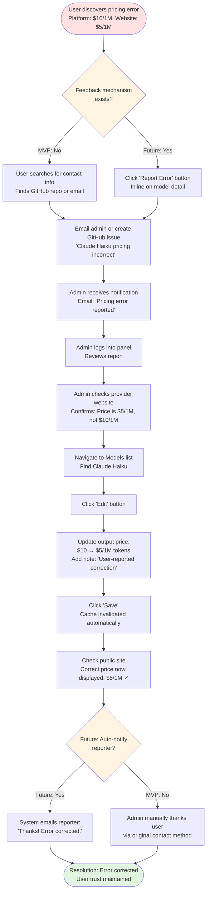

# llm-token-price UX/UI Specification

_Generated on 2025-10-16 by Pablo_

## Executive Summary

### Project Overview

**LLM Cost Comparison Platform** is an enterprise-scale web application designed to solve the critical challenge developers face when selecting cost-effective Large Language Models (LLMs). With over 50 commercial and open-source models competing across different pricing structures, development teams currently waste 3-5 hours manually comparing scattered pricing information, leading to suboptimal choices that can cost organizations $5K-$50K+ annually in unnecessary LLM spend.

This platform delivers three rarely-combined capabilities: always-current pricing data, algorithm-driven decision support, and interactive visual analysis. The MVP targets 5,000+ monthly active users within 6 months, enabling data-driven model selection that reduces LLM operational costs by 15-40% for development teams.

### UX Scope and Complexity

This UX specification covers a **Level 4 (Enterprise Scale)** project with significant interface complexity:

**Primary User Interfaces:**
- **Public Comparison Interface**: Sortable/filterable table displaying 50+ LLM models with pricing, capabilities, and benchmark scores
- **Model Detail System**: Deep-dive modals with tabbed specifications, complete benchmark analysis, and embedded cost calculators
- **Multi-Model Comparison View**: Side-by-side comparison of 2-5 models with synchronized chart visualizations
- **Cost Calculator**: Standalone and embedded calculators with scenario presets and real-time cost projections
- **Admin Panel**: Authenticated CRUD interface for managing models, pricing, capabilities, and benchmarks

**Visualization System:**
- Bar charts comparing benchmark scores across multiple models
- Pricing comparison visualizations with cost savings calculations
- Capability matrices with icon-based visual indicators
- Interactive charts with hover tooltips and legend filtering

**Platform Requirements:**
- **Desktop-first** design optimized for developer workflows (high information density)
- **Responsive adaptation** to tablet and mobile with card-based layouts
- **Performance targets**: <2s initial load, <100ms cost calculations, <1s chart rendering
- **Accessibility**: WCAG 2.1 AA compliance for core workflows

### Key UX Challenges

1. **Information Density vs. Clarity**: Developers need comprehensive data (pricing, 8+ benchmarks, capabilities) without overwhelming cognitive load
2. **Progressive Disclosure**: Balancing quick scanning (table view) with deep analysis (comparison view, detail modals)
3. **Multi-Dimensional Comparison**: Supporting comparison across price, quality, and capabilities simultaneously
4. **Algorithm Trust**: Making "Best Value" smart filter recommendations transparent and explainable
5. **Responsive Transformation**: Converting data-dense tables to mobile-friendly card layouts without losing critical information

### Design Foundation from PRD

The PRD establishes these **UX Design Principles**:

1. **Data Clarity Over Visual Flair** - Information density optimized for developer users, clear typography, minimalist design
2. **Progressive Disclosure** - Simple table → filters → comparison → charts, revealing complexity on demand
3. **Immediate Feedback** - Instant calculations, real-time filtering, loading states for operations >200ms
4. **Developer-First Usability** - Keyboard shortcuts, technical accuracy, sortable columns

This UX specification expands these principles into detailed user flows, component specifications, visual design systems, and interaction patterns required for implementation.

---

## 1. UX Goals and Principles

### 1.1 Target User Personas

#### Primary Persona: Alex - Backend Developer

**Demographics:**
- Role: Backend Developer, Full-Stack Engineer
- Experience: 2-5 years professional development
- Context: Working on projects requiring LLM integration (RAG, chatbots, automation)

**Goals:**
- Select optimal LLM balancing cost and quality for specific use cases
- Calculate accurate cost forecasts for budget planning
- Make data-driven decisions defensible to engineering managers
- Complete model evaluation in <15 minutes (vs 3-5 hours manual research)

**Pain Points:**
- Overwhelmed by 50+ model options with inconsistent pricing structures
- Spending hours manually comparing scattered pricing information
- Uncertainty about which benchmarks matter for specific use cases
- Difficulty forecasting costs without hands-on testing
- Risk of choosing suboptimal models costing organization thousands annually

**Behaviors:**
- **Task-oriented**: Wants to complete evaluation and move on to implementation
- **Data-driven**: Trusts numbers and benchmarks over marketing claims
- **Comparison-focused**: Evaluates multiple options before deciding
- **Budget-conscious**: Needs to justify costs to management

**Technical Proficiency:**
- Highly comfortable with technical interfaces
- Expects keyboard shortcuts and power-user features
- Prefers dense information over simplified summaries
- Accustomed to tools like GitHub, VSCode, Datadog

**User Journey Touchpoints:**
1. Discovers platform via search or developer community
2. Scans comparison table to understand landscape
3. Applies filters to narrow options by requirements
4. Uses smart filters for algorithm recommendations
5. Compares 3-5 finalist models side-by-side
6. Reviews detailed specs and benchmarks in model detail
7. Calculates costs for projected workload
8. Makes decision and bookmarks for reference

---

#### Secondary Persona: Jordan - Engineering Manager / CTO

**Demographics:**
- Role: Engineering Manager, Technical Leader, CTO
- Experience: 8+ years, managing teams of 5-50 engineers
- Context: Quarterly reviews of AI infrastructure spending

**Goals:**
- Optimize AI infrastructure costs across multiple use cases
- Establish cost-effective multi-model strategy
- Validate team's model selections against alternatives
- Forecast annual AI spending for budget planning

**Pain Points:**
- Current spending too high (team using expensive models for all use cases)
- Lack of visibility into cost-saving opportunities
- Need data to justify strategic decisions to finance/executive team
- Limited time for deep technical evaluation

**Behaviors:**
- **Strategic thinker**: Evaluates across multiple use cases simultaneously
- **ROI-focused**: Calculates potential savings and payback periods
- **Delegation-oriented**: Needs to quickly understand tradeoffs to guide team
- **Documentation-heavy**: Shares analysis with stakeholders

**Technical Proficiency:**
- Technical background but less hands-on coding
- Comfortable with data analysis and visualization
- Values clear visual comparisons and summary insights
- Appreciates export/share functionality for presentations

**User Journey Touchpoints:**
1. Reviews current model implementations and costs
2. Uses cost calculator for multiple use case scenarios
3. Applies filters to find alternatives for each use case
4. Compares current vs. recommended models
5. Calculates potential savings (monthly/annual)
6. Exports comparison data for team/executive review
7. Documents multi-model strategy recommendations

---

#### Tertiary Persona: Sam - Platform Administrator

**Demographics:**
- Role: Platform maintainer, Data curator (could be developer on team)
- Experience: Varies (part-time responsibility)
- Context: Weekly data maintenance schedule

**Goals:**
- Keep pricing data current and accurate
- Add new models as they launch
- Maintain data quality and user trust
- Minimize time spent on manual updates (target <1 hour/week)

**Pain Points:**
- Manual data entry is tedious and error-prone
- Tracking pricing changes across multiple provider websites
- Validating benchmark scores for accuracy
- Limited time for maintenance tasks

**Behaviors:**
- **Efficiency-focused**: Wants bulk operations and streamlined workflows
- **Quality-conscious**: Checks data accuracy before publishing
- **Process-oriented**: Follows consistent update procedures
- **Responsive**: Acts quickly when users report data issues

**Technical Proficiency:**
- Comfortable with admin interfaces and CRUD operations
- Prefers CSV import over manual form entry
- Values validation warnings and error prevention
- Appreciates audit logs and timestamp tracking

**User Journey Touchpoints:**
1. Logs into admin panel weekly
2. Reviews models needing updates (>7 days old)
3. Updates pricing from provider websites
4. Adds new model entries with capabilities
5. Bulk imports benchmark scores via CSV
6. Validates data quality on public interface
7. Documents changes in admin log

### 1.2 Usability Goals

Our usability goals align with the target personas' needs and project success metrics:

#### 1. **Time Efficiency** - Reduce model evaluation time by 90%
- **Target**: Complete model selection in <15 minutes (from current 3-5 hours)
- **Success Metric**: 70%+ of first-time users complete cost calculation or model comparison without assistance
- **Design Implications**:
  - Default views show most critical information immediately (no required clicks to see pricing)
  - Smart filters provide "shortcuts" to recommendations
  - Progressive disclosure reveals complexity only when needed
  - Search and filters respond in real-time (<100ms)

#### 2. **Decision Confidence** - Enable data-driven selections
- **Target**: Users trust platform recommendations enough to make $10K+ annual spending decisions
- **Success Metric**: 80%+ of users bookmark or return to platform for future evaluations
- **Design Implications**:
  - Complete transparency: show calculation formulas, data sources, update timestamps
  - Benchmark scores linked to source URLs where possible
  - "Best Value" algorithm explained with clear methodology
  - Visual comparisons make tradeoffs obvious (price vs. quality)

#### 3. **Cognitive Load Management** - High information density without overwhelm
- **Target**: Display 50+ models with 15+ attributes each without causing analysis paralysis
- **Success Metric**: Users successfully narrow 50+ models to 3-5 finalists using filters
- **Design Implications**:
  - Clear visual hierarchy: pricing and key benchmarks prominent
  - Consistent iconography for capabilities (learn once, recognize everywhere)
  - Alternating row colors and generous whitespace for table scannability
  - Sticky headers maintain context during scrolling

#### 4. **Error Prevention** - Minimize misinterpretation
- **Target**: Users select appropriate models for their use cases (avoid mismatches like choosing vision model without vision requirements)
- **Success Metric**: <5% of users report selecting "wrong" model after initial use
- **Design Implications**:
  - Tooltips explain technical terms (MMLU, GSM8K, function calling)
  - Warning indicators for stale data (>14 days old)
  - Capability badges show at-a-glance what model supports
  - Cost calculator prevents unrealistic inputs (e.g., >1B tokens/month flagged)

#### 5. **Accessibility** - Inclusive for diverse abilities
- **Target**: WCAG 2.1 AA compliance for core workflows
- **Success Metric**: Screen reader users can complete table navigation, filtering, and cost calculation
- **Design Implications**:
  - Semantic HTML with proper ARIA labels
  - Keyboard navigation for all interactive elements
  - Sufficient color contrast ratios (4.5:1 minimum for text)
  - Focus indicators clearly visible
  - Charts include accessible data tables as alternatives

#### 6. **Performance** - Instant feedback for all interactions
- **Target**: Platform feels fast even with 100+ models and complex calculations
- **Success Metric**: 95% of interactions complete in <200ms
- **Design Implications**:
  - Optimistic UI updates (show change immediately, sync backend)
  - Loading skeletons for operations >200ms
  - Debounced search inputs (300ms) to avoid excessive re-renders
  - Virtualized scrolling for long tables
  - Client-side filtering/sorting after initial data load

#### 7. **Learnability** - Minimal onboarding required
- **Target**: Developers (familiar with data tools) productive on first visit
- **Success Metric**: 70%+ task completion rate for first-time users
- **Design Implications**:
  - Familiar patterns from developer tools (sortable tables, filters sidebar)
  - Consistent interaction patterns throughout platform
  - Inline help via tooltips (don't require documentation reading)
  - Smart defaults (table sorted by name, filters cleared)

---

### 1.3 Design Principles

These principles guide every design decision and resolve conflicts between competing concerns:

#### Principle 1: **Data Clarity Over Visual Flair**

**What it means:**
Information accuracy and scannability take precedence over decorative design elements.

**In practice:**
- ✅ High-contrast typography with generous line spacing
- ✅ Tables with clear column headers and consistent data formatting
- ✅ Minimalist color palette (grays for structure, color for data/meaning)
- ❌ Unnecessary animations, gradients, or decorative illustrations
- ❌ "Hiding" data behind interactions to achieve visual simplicity

**Example application:**
The comparison table shows actual numbers ($0.50/1M tokens) rather than visual metaphors ($ symbols or coin icons). Pricing is always visible in the default view—no hovering or clicking required.

---

#### Principle 2: **Progressive Disclosure**

**What it means:**
Start simple, reveal complexity on demand. Every screen should have a clear "starting point" that works for 80% of users, with paths to depth for the 20% who need it.

**In practice:**
- ✅ Table view shows 6-8 key columns (name, provider, pricing, top 3 benchmarks)
- ✅ "View Details" opens modal with complete specifications
- ✅ Filters start collapsed with most common options visible
- ✅ Advanced filters (price range, specific benchmarks) revealed on expand
- ❌ Showing all 15 benchmark scores in main table
- ❌ Requiring configuration before showing any results

**Example application:**
Main comparison table shows input/output pricing and 3 key benchmarks (MMLU, HumanEval, GSM8K). Model detail modal reveals all 8+ benchmarks, organized by category. Users scanning for quick overview see essentials; users doing deep evaluation access everything.

---

#### Principle 3: **Immediate Feedback**

**What it means:**
Every user action receives instant visual confirmation. Users should never wonder "did that work?"

**In practice:**
- ✅ Filter checkboxes update table instantly (no "Apply" button)
- ✅ Cost calculator recalculates as user types (debounced 100ms)
- ✅ Sort direction indicators visible in column headers
- ✅ Loading spinners for operations >200ms
- ✅ Success/error toasts confirm save operations
- ❌ Silent failures or delayed feedback
- ❌ Requiring page refresh to see changes

**Example application:**
When user adjusts cost calculator slider from 1M to 5M tokens, cost estimates update in real-time for all visible models. When user checks "Supports function calling" filter, table immediately shows only matching models with count indicator ("Showing 23 of 54 models").

---

#### Principle 4: **Developer-First Usability**

**What it means:**
Design for power users who value efficiency and control. Don't oversimplify or "dumb down" the interface—developers prefer more options over fewer.

**In practice:**
- ✅ Keyboard shortcuts for common actions (/ for search, Esc to close modals)
- ✅ Sortable columns (click header to sort)
- ✅ URL parameters for shareable states (?sort=price&filter=openai)
- ✅ Technical language accepted (don't say "smartness" when "composite quality score" is accurate)
- ✅ Export options (CSV, shareable links)
- ❌ Hiding advanced features to "simplify"
- ❌ Oversimplified explanations that lack technical depth

**Example application:**
Instead of single "Sort" dropdown, every column header is clickable for sorting. Instead of hiding filter sidebar on mobile to "simplify," provide drawer with full filter functionality. Instead of vague "Updated recently" timestamp, show exact date: "Updated 3 days ago (2025-10-13)".

---

#### Principle 5: **Algorithmic Transparency**

**What it means:**
When platform provides recommendations or calculations, show the methodology. Users should understand *why* a model is recommended, not just *that* it is.

**In practice:**
- ✅ "Best Value" filter explains QAPS formula and benchmark weights
- ✅ Quality score breakdown shows component scores
- ✅ Cost calculator shows formula: (volume × ratio × input_price) + (volume × (1-ratio) × output_price)
- ✅ Benchmark interpretations visible ("Higher is better" vs "Lower is better")
- ❌ "Black box" recommendations without explanation
- ❌ Hiding calculation details to appear simpler

**Example application:**
When "Best Value" filter is activated, explanation panel appears: "Best Value ranks models by Quality-Adjusted Price per Score (QAPS). Quality Score = weighted average of benchmarks (30% reasoning, 25% code, 20% math...). QAPS = Quality Score / Total Price."

---

#### Conflict Resolution Example:

**Scenario:** Should we show all 8 benchmarks in the main comparison table?

- **Principle 1 (Data Clarity)** says: Yes, more data = more clarity
- **Principle 2 (Progressive Disclosure)** says: No, 8 columns overwhelms quick scanning
- **Principle 3 (Immediate Feedback)** says: Neutral, performance matters more
- **Principle 4 (Developer-First)** says: Maybe, but provide column visibility controls

**Resolution:** Show 3 key benchmarks by default with column selector allowing users to add/remove columns. This balances scannability (P2) with power-user control (P4) while maintaining clarity (P1).

---

## 2. Information Architecture

### 2.1 Site Map

```
┌─────────────────────────────────────────────────────────────┐
│                    LLM Cost Comparison Platform              │
└─────────────────────────────────────────────────────────────┘
                              │
                ┌─────────────┴─────────────┐
                │                           │
         PUBLIC INTERFACE            ADMIN PANEL
                │                           │
    ┌───────────┼───────────┐              │
    │           │           │              │
┌───▼────┐  ┌──▼──┐   ┌───▼────┐    ┌────▼─────┐
│ Home / │  │Cost │   │Compare │    │  Login   │
│ Table  │  │Calc │   │ View   │    │          │
└───┬────┘  └─────┘   └────────┘    └────┬─────┘
    │                                     │
    │                              ┌──────▼──────────┐
    │                              │   Dashboard     │
    │                              └──────┬──────────┘
    │                                     │
    └─────────────┬───────────────────────┼──────────────┐
                  │                       │              │
            ┌─────▼─────┐          ┌─────▼──────┐  ┌───▼────────┐
            │Model Detail│          │   Models   │  │ Benchmarks │
            │   Modal    │          │ Management │  │Management  │
            └─────┬──────┘          └─────┬──────┘  └────────────┘
                  │                       │
            ┌─────┴─────┐           ┌─────┴──────┐
            │           │           │            │
        ┌───▼──┐   ┌───▼───┐   ┌───▼────┐  ┌───▼─────┐
        │Overview│ │Benchmarks│ │Add/Edit│ │ Import  │
        │  Tab  │  │   Tab   │  │ Model  │  │Benchmarks│
        └───────┘  └────┬────┘  └────────┘ └─────────┘
                        │
                   ┌────▼─────┐
                   │ Pricing  │
                   │   Tab    │
                   │ w/Calc   │
                   └──────────┘
```

**Primary Sections:**

**1. Public Interface** (Unauthenticated Access)
   - **Home / Comparison Table** (`/`)
     - Default landing page
     - Sortable/filterable table of all models
     - Search functionality
     - Filter sidebar (providers, capabilities, price range)
     - Smart filters (Best Value)
     - Model selection for comparison
     - Comparison basket widget

   - **Cost Calculator** (`/calculator`)
     - Standalone calculator page
     - Input controls (volume, ratio)
     - Preset scenarios
     - Results table (all models ranked by cost)
     - Cost comparison chart
     - Share/export functionality

   - **Comparison View** (`/compare?models=1,2,3`)
     - Side-by-side model comparison (2-5 models)
     - Comparison table (attributes aligned)
     - Benchmark comparison section
     - Pricing comparison visualization
     - Capability matrix
     - Interactive charts
     - Export comparison data

   - **Model Detail Modal** (Overlay: `/?model=gpt-4`)
     - Accessible from table click
     - Tabbed interface:
       - **Overview Tab**: Full specifications, pricing, capabilities
       - **Benchmarks Tab**: All benchmark scores by category
       - **Pricing Tab**: Detailed pricing breakdown + embedded calculator
     - Shareable URL with model ID

**2. Admin Panel** (Authenticated Access)
   - **Admin Login** (`/admin/login`)
     - Username/password authentication
     - Session management

   - **Admin Dashboard** (`/admin`)
     - Overview metrics (total models, stale data count, recent additions)
     - Data quality indicators
     - Quick action links
     - Recent activity log

   - **Models Management** (`/admin/models`)
     - Models list table (search, filter, sort)
     - Add new model button → Add form
     - Edit button per row → Edit form
     - Delete with confirmation
     - Bulk operations (update, delete)
     - Timestamp tracking

   - **Add/Edit Model Form** (`/admin/models/new`, `/admin/models/:id/edit`)
     - Basic info section (name, provider, version, status)
     - Pricing section (input/output prices, currency, validity)
     - Capabilities section (context window, feature flags)
     - Benchmark scores section (add/edit scores)

   - **Benchmarks Management** (`/admin/benchmarks`)
     - Benchmark definitions list
     - Add/edit benchmark definitions
     - CSV import for bulk benchmark scores
     - Validation and error reporting

**Page Hierarchy Depth:**
- Public pages: 2 levels max (Home → Modal, Home → Calculator)
- Admin pages: 3 levels max (Admin → Models → Edit Form)
- No dead ends: All pages have clear return paths

---

### 2.2 Navigation Structure

#### Public Interface Navigation

**Primary Navigation (Header):**
```
┌────────────────────────────────────────────────────────────┐
│ [Logo] LLM Cost Comparison                                 │
│                                                             │
│  Models  |  Calculator  |  [Search Box]         [Admin]    │
└────────────────────────────────────────────────────────────┘
```

**Elements:**
- **Logo/Site Name** (left): Always links to home (`/`)
- **Models** link: Navigate to main comparison table (home)
- **Calculator** link: Navigate to standalone calculator
- **Search Box** (center-right): Global search (filters table on home, navigates to home from other pages)
- **Admin Link** (right): Access admin panel (login if not authenticated)

**Mobile Navigation:**
- Hamburger menu collapses navigation on <768px
- Search becomes icon that expands to full-width input

---

**Filter Sidebar (Home Page Only):**

Located on left side of comparison table (30% width on desktop, drawer on mobile).

**Filter Sections** (vertically stacked, collapsible):

1. **Smart Filters** (Always visible, top section)
   - "Best Value" toggle button (distinctive styling)
   - Explanation link/icon

2. **Provider Filter**
   - Checkbox list: OpenAI, Anthropic, Google, Meta, Mistral, Other
   - "Select All" / "Clear All" links

3. **Capabilities Filter**
   - Checkboxes:
     - ☐ Function Calling
     - ☐ Vision Support
     - ☐ Audio Input
     - ☐ Audio Output
     - ☐ Streaming
     - ☐ JSON Mode
   - Tooltips explain each capability

4. **Price Range** (Collapsible, starts collapsed)
   - Dual-range slider (min/max)
   - Number inputs for precise entry
   - Based on combined input+output price

5. **Benchmark Filters** (Future enhancement, MVP: view-only)

**Footer:**
- "Clear All Filters" button (visible when any filter active)
- Active filter count badge

---

**Comparison Basket (Home Page, Conditional):**

Appears at top of page when 1+ models selected.

```
┌────────────────────────────────────────────────────────┐
│ Selected Models (3):                                    │
│ [GPT-4 ×] [Claude Haiku ×] [Llama-3 ×]                │
│                                                         │
│ [Clear All]  [Compare Selected] (disabled if <2)       │
└────────────────────────────────────────────────────────┘
```

---

#### Admin Panel Navigation

**Admin Sidebar (Left, Persistent):**

```
┌──────────────────────┐
│  Admin Panel         │
├──────────────────────┤
│ ► Dashboard          │
│ ► Models             │
│ ► Benchmarks         │
│                      │
│ ─────────────        │
│ Logged in: Pablo     │
│ [Logout]             │
└──────────────────────┘
```

**Elements:**
- **Dashboard**: Overview and metrics
- **Models**: Model management (links to models list)
- **Benchmarks**: Benchmark definitions and imports
- **User info**: Shows logged-in admin name
- **Logout**: Clears session, returns to public home

**Admin Header:**
- Breadcrumb navigation: Admin > Models > Edit Model
- "View Public Site" link (returns to public interface)

---

#### Breadcrumb Navigation

**Used in Admin Panel only:**

```
Admin > Models > Edit: GPT-4
```

- Each segment clickable (returns to that level)
- Current page not linked (plain text)

---

#### Modal Navigation (Model Detail)

**Tab Navigation (Horizontal tabs at modal top):**

```
┌──────────────────────────────────────────────────┐
│  GPT-4 by OpenAI                           [×]   │
├──────────────────────────────────────────────────┤
│  Overview  |  Benchmarks  |  Pricing             │
│  ────────                                        │
│                                                   │
│  [Tab content here]                              │
│                                                   │
└──────────────────────────────────────────────────┘
```

- Active tab underlined or highlighted
- Click tab to switch content
- Close button (×) dismisses modal, returns to table
- Browser back button also closes modal

---

#### Keyboard Navigation

**Global Shortcuts:**
- **`/`** - Focus search input
- **`Esc`** - Close modal, clear search, or collapse mobile menu
- **`?`** - Show keyboard shortcuts help (future enhancement)

**Table Navigation:**
- **`↑` / `↓`** - Navigate rows (highlight row)
- **`Enter`** - Open model detail for highlighted row
- **`Space`** - Toggle selection checkbox for highlighted row
- **`Tab`** - Navigate between interactive elements (filters, buttons, table)

**Comparison View:**
- **`←` / `→`** - Cycle between model cards (mobile)

---

#### URL Structure & Shareability

**Public URLs:**
- Home: `/`
- Home with filters: `/?provider=openai&capability=vision&sort=price`
- Model detail: `/?model=gpt-4` (opens modal overlay)
- Calculator: `/calculator`
- Calculator with params: `/calculator?volume=5000000&ratio=60`
- Comparison: `/compare?models=1,2,3`

**Admin URLs:**
- Login: `/admin/login`
- Dashboard: `/admin`
- Models list: `/admin/models`
- Add model: `/admin/models/new`
- Edit model: `/admin/models/:id/edit`
- Benchmarks: `/admin/benchmarks`

**Design Rationale:**
- Public URLs use query parameters for state (shareable, bookmarkable)
- Admin URLs use RESTful paths (standard CRUD patterns)
- Model detail as modal with URL parameter (preserves table state when closing)

---

#### Navigation Interaction Patterns

**Progressive Enhancement:**
1. **First Visit** → See full table, all filters visible
2. **Apply Filter** → URL updates, table filters, count updates
3. **Click Model** → Modal opens, URL updates with `?model=id`
4. **Share URL** → Recipient sees same filtered table + opened modal
5. **Close Modal** → URL clears model param, table state persists

**Error Handling:**
- Invalid model ID in URL → Show error message, redirect to home
- Invalid filter values → Ignore invalid params, apply valid ones
- Missing admin auth → Redirect to login with return URL

**State Persistence:**
- Filter state: URL parameters (shareable across sessions)
- Table sort: URL parameters
- Selected models: Session storage (lost on refresh by design—prevents stale selections)
- Admin session: HTTP-only cookie (security)

---

## 3. User Flows

### User Flow 1: Model Discovery and Selection (Primary Journey)

**User Goal:** Select optimal LLM for new RAG feature balancing cost and quality

**Entry Points:**
- Google search "LLM pricing comparison"
- Developer community recommendation
- Direct URL

**Success Criteria:** User selects model with confidence in <15 minutes

```mermaid
flowchart TD
    Start([User arrives at platform]) --> Scan[Scan comparison table<br/>Default: All models, sorted by name]

    Scan --> Sort{Need to understand<br/>price landscape?}
    Sort -->|Yes| SortPrice[Click 'Input Price' column header<br/>Table sorts cheapest → expensive]
    Sort -->|No| Filter
    SortPrice --> Notice[Notice dramatic price variance<br/>20x difference between cheapest/expensive]
    Notice --> Filter

    Filter[Apply requirement filters] --> FilterFunc[✓ Supports Function Calling<br/>Required for RAG]
    FilterFunc --> FilterPrice[Set price range<br/>Exclude premium models outside budget]
    FilterPrice --> FilterResult[Table narrows: 50 models → 8 models<br/>Count indicator shows '8 matching models']

    FilterResult --> SmartFilter{Want algorithm<br/>recommendation?}
    SmartFilter -->|Yes| BestValue[Click 'Best Value' smart filter]
    SmartFilter -->|No| Select

    BestValue --> Explanation[Read explanation panel<br/>'QAPS = Quality Score / Price']
    Explanation --> ReviewRank[Review top 5 ranked models<br/>See QAPS scores & rationale]
    ReviewRank --> Select

    Select[Select 3 promising models<br/>for deeper comparison] --> Check1[☑ GPT-3.5-turbo]
    Check1 --> Check2[☑ Claude Haiku]
    Check2 --> Check3[☑ Llama-3-8B]
    Check3 --> Basket[Comparison basket appears<br/>'3 models selected']

    Basket --> Compare[Click 'Compare Selected' button<br/>Navigate to /compare?models=1,2,3]
    Compare --> SideBySide[Review side-by-side comparison<br/>Pricing differences visible]
    SideBySide --> BenchChart[View benchmark bar chart<br/>Claude leads reasoning, GPT balanced]
    BenchChart --> Capabilities[Check capability matrix<br/>All support function calling ✓]

    Capabilities --> DetailClick[Click 'Claude Haiku' for details<br/>Modal opens: /?model=claude-haiku]
    DetailClick --> OverviewTab[Overview Tab:<br/>200K context window ✓<br/>Updated 3 days ago ✓]

    OverviewTab --> PricingTab[Click 'Pricing' tab]
    PricingTab --> Calculator[Use embedded cost calculator<br/>Input: 2M tokens/month, 70/30 ratio]
    Calculator --> SeeCost[See monthly cost: $140<br/>Within $200/month budget ✓]

    SeeCost --> Decision{Confident in<br/>selection?}
    Decision -->|Yes| Bookmark[Bookmark page<br/>Make selection: Claude Haiku]
    Decision -->|No| BackToCompare[Back to comparison<br/>Review alternatives]
    BackToCompare --> DetailClick

    Bookmark --> End([Task complete: <15 min<br/>Confident decision with data])

    style Start fill:#e1f5e1
    style End fill:#e1f5e1
    style Decision fill:#fff4e1
    style SmartFilter fill:#fff4e1
    style Sort fill:#fff4e1
```



**Key Interactions:**
1. **Immediate scanning** - Table loads with all data visible (no loading delays)
2. **Real-time filtering** - Each filter checkbox updates table instantly, count shows "X of Y models"
3. **Progressive narrowing** - 50 → 8 models via filters, then 8 → 3 via selection
4. **Algorithm assistance** - Smart filter provides shortcut to top recommendations
5. **Deep dive on demand** - Modal opens for detailed specs without losing table context
6. **Embedded calculation** - Calculator within modal eliminates navigation
7. **Shareable state** - URL updates at each step, allowing bookmarking

**Error States:**
- No models match filters → "No models found. Try adjusting filters" + suggest clearing
- Model detail fails to load → Show error in modal, allow retry
- Calculator with unrealistic inputs → Warning: "Volume >100M tokens/month is unusual. Double-check?"

---

### User Flow 2: Cost Calculation for Budget Planning

**User Goal:** Forecast monthly LLM costs for production deployment

**Entry Points:**
- Return visitor (familiar with platform)
- Direct link to calculator
- From model detail modal

**Success Criteria:** Accurate cost estimate for budget approval

```mermaid
flowchart TD
    Start([User returns to platform<br/>Familiar with interface]) --> NavCalc[Click 'Calculator' in header<br/>Navigate to /calculator]

    NavCalc --> CalcPage[Calculator page loads<br/>Default: 1M tokens, 50/50 ratio]

    CalcPage --> InputVol[Adjust monthly volume slider<br/>1M → 5M tokens]
    InputVol --> InputRatio[Adjust input/output ratio<br/>50/50 → 60/40]

    InputRatio --> Instant[Results update instantly<br/>All models recalculated]
    Instant --> ReviewTable[Review cost table<br/>Sorted cheapest → expensive]

    ReviewTable --> Notice1[Notice: GPT-4 = $750/month<br/>Way over budget ❌]
    Notice1 --> Notice2[Notice: Claude Haiku = $350/month<br/>Acceptable ✓]

    Notice2 --> Sensitivity{Want to test<br/>sensitivity?}
    Sensitivity -->|Yes| AdjustRatio[Change ratio to 50/50<br/>See cost drop to $320/month]
    Sensitivity -->|No| Export

    AdjustRatio --> Chart[View cost comparison chart<br/>Visual confirms Claude is optimal]
    Chart --> Export

    Export[Take screenshot of results<br/>Or click 'Share' for URL]
    Export --> ShareURL[Copy shareable link<br/>/calculator?volume=5000000&ratio=60]

    ShareURL --> SendManager[Share with engineering manager<br/>URL shows exact parameters]
    SendManager --> Approval[Manager approves $350/month budget]

    Approval --> End([Task complete<br/>Accurate forecast obtained])

    style Start fill:#e1f5e1
    style End fill:#e1f5e1
    style Sensitivity fill:#fff4e1
```



**Key Interactions:**
1. **Direct navigation** - Repeat user knows to use Calculator link
2. **Real-time calculation** - Debounced 100ms, feels instant
3. **Visual ranking** - Table automatically sorts by cost (cheapest first)
4. **Sensitivity testing** - Easy parameter adjustment to explore scenarios
5. **Shareability** - URL captures exact calculation for stakeholder review
6. **Screenshot-friendly** - Table and chart designed for export

**Preset Scenarios** (Quick access buttons):
- "Small Project": 1M tokens, 60/40 ratio
- "Medium Project": 5M tokens, 50/50 ratio
- "Large Project": 20M tokens, 70/30 ratio
- "Custom": Manual entry

---

### User Flow 3: Multi-Model Strategy Optimization (Secondary Persona)

**User Goal:** Reduce AI infrastructure spending across multiple use cases

**Entry Points:**
- Quarterly cost review
- Noticing high spending
- Team recommendation

**Success Criteria:** Identify cost savings >40% with data to support decision

```mermaid
flowchart TD
    Start([Engineering Manager<br/>Reviews AI spending]) --> CurrentCost[Current state:<br/>Using GPT-4 for everything<br/>$2,800/month total]

    CurrentCost --> Platform[Access LLM Cost Platform<br/>Familiar from team usage]

    Platform --> UseCase1[Analyze Use Case 1:<br/>Code Generation]
    UseCase1 --> Filter1[Apply filters:<br/>✓ High code benchmark<br/>Price < GPT-4]
    Filter1 --> BestValue1[Use 'Best Value' filter<br/>See recommendations]
    BestValue1 --> Find1[Find: Claude Sonnet<br/>Higher code score, 40% cheaper]

    Find1 --> Calc1[Use calculator<br/>Current: GPT-4 = $800/month<br/>Proposed: Claude Sonnet = $480/month]
    Calc1 --> Save1[Savings: $320/month]

    Save1 --> UseCase2[Analyze Use Case 2:<br/>Customer Support]
    UseCase2 --> Filter2[Filter requirements:<br/>Fast response, lower cost priority]
    Filter2 --> Find2[Find: GPT-3.5-turbo<br/>Sufficient quality, 80% cheaper]

    Find2 --> Calc2[Calculate savings:<br/>Current: $1,200/month<br/>Proposed: $240/month<br/>Savings: $960/month]

    Calc2 --> UseCase3[Analyze Use Case 3:<br/>Document Summarization]
    UseCase3 --> Find3[Find: Claude Haiku<br/>Fast, cheap, good enough]
    Find3 --> Calc3[Calculate savings:<br/>Current: $800/month<br/>Proposed: $480/month<br/>Savings: $320/month]

    Calc3 --> TotalCalc[Calculate total strategy<br/>New total: $1,200/month<br/>vs Current: $2,800/month]
    TotalCalc --> Savings[Total savings: $1,600/month<br/>58% cost reduction<br/>$19,200/year ROI]

    Savings --> Export[Export comparison data<br/>Multiple screenshots or CSV]
    Export --> Document[Create recommendation doc<br/>Use case → Model mapping]
    Document --> Present[Present to team/finance<br/>Data-driven justification]

    Present --> Implement[Implement multi-model strategy]
    Implement --> End([Outcome: $19K+ annual savings<br/>Documented decision])

    style Start fill:#e1f5e1
    style End fill:#e1f5e1
    style Savings fill:#d4edda
```



**Key Interactions:**
1. **Multiple calculator sessions** - Repeat pattern for each use case
2. **Filter customization** - Different filters per use case (code vs. support vs. summarization)
3. **Comparative analysis** - Mental model: Current cost vs. Proposed cost
4. **ROI calculation** - Platform shows monthly, user calculates annual
5. **Export for stakeholders** - CSV or screenshots for documentation

---

### User Flow 4: Admin Weekly Data Maintenance

**User Goal:** Keep model pricing current and accurate (<1 hour/week)

**Entry Points:**
- Scheduled weekly maintenance
- User-reported pricing error
- New model launch announcement

**Success Criteria:** Platform data remains 95%+ accurate

```mermaid
flowchart TD
    Start([Weekly maintenance schedule<br/>Wednesday morning]) --> Login[Navigate to /admin/login<br/>Enter credentials]

    Login --> Dashboard[Admin dashboard loads<br/>See metrics]
    Dashboard --> Review[Review data quality:<br/>'5 models need updates (>7 days old)'<br/>'2 new models to add']

    Review --> ModelsList[Click 'Models' → Models list<br/>Sort by 'Last Updated' ascending]
    ModelsList --> Stale[See 5 stale models highlighted<br/>Yellow indicator: >7 days]

    Stale --> Check1[Open provider website in new tab<br/>Check Claude Opus pricing]
    Check1 --> PriceChange{Price changed?}

    PriceChange -->|Yes| EditModel[Click 'Edit' button<br/>Edit form opens]
    PriceChange -->|No| NextModel

    EditModel --> UpdatePrice[Update pricing fields:<br/>Output price: $75 → $60/1M tokens<br/>Validity dates updated]
    UpdatePrice --> Save[Click 'Save'<br/>Success message: 'Model updated']
    Save --> ValidatePublic[Open public site in new tab<br/>Verify price shown correctly]

    ValidatePublic --> NextModel[Move to next stale model<br/>Repeat process]
    NextModel --> AllUpdated{All stale models<br/>updated?}
    AllUpdated -->|No| Check1
    AllUpdated -->|Yes| NewModel

    NewModel[Add new model] --> AddButton[Click 'Add New Model'<br/>Add form opens]
    AddButton --> FillBasic[Fill basic info:<br/>Name: Gemini 1.5 Pro<br/>Provider: Google<br/>Version: 1.5]
    FillBasic --> FillPricing[Fill pricing:<br/>Input: $3.50/1M<br/>Output: $10.50/1M]
    FillPricing --> FillCaps[Fill capabilities:<br/>Context: 1M tokens<br/>✓ Function calling<br/>✓ Vision]

    FillCaps --> SaveNew[Click 'Save'<br/>Model created successfully]
    SaveNew --> BenchImport[Navigate to 'Benchmarks'<br/>Prepare CSV import]

    BenchImport --> UploadCSV[Upload benchmark CSV:<br/>model_id, benchmark_name, score]
    UploadCSV --> Validate[System validates CSV<br/>'15 rows, 0 errors']
    Validate --> Import[Click 'Import'<br/>Success: '15 benchmarks imported']

    Import --> FinalCheck[Final validation on public site<br/>New model visible with benchmarks ✓]
    FinalCheck --> Log[Document changes in admin log<br/>'Updated 5 prices, added 1 model']

    Log --> End([Maintenance complete: 45 minutes<br/>Data quality maintained])

    style Start fill:#e1f5e1
    style End fill:#e1f5e1
    style PriceChange fill:#fff4e1
    style AllUpdated fill:#fff4e1
```

**Key Interactions:**
1. **Dashboard triage** - Immediately see what needs attention
2. **Sorted priority list** - Oldest updates first
3. **Visual indicators** - Color coding for data age (green/yellow/red)
4. **Bulk CSV import** - Efficient benchmark entry (vs. manual forms)
5. **Validation workflow** - Check public site after admin changes
6. **Audit trail** - Admin log tracks all changes

**Efficiency Features:**
- Bulk operations: Update multiple models' currency at once
- Duplicate detection: Warn before creating similar model
- Validation warnings: Flag unusual scores for review
- Quick edit: Inline editing for simple price updates (future)

---

### User Flow 5: Error Recovery - Pricing Discrepancy Reported

**User Goal:** Correct pricing error discovered by user

**Entry Points:**
- User notices discrepancy vs. provider website
- User contacts platform (email, GitHub issue)

**Success Criteria:** Error corrected within 24 hours



**Key Interactions:**
1. **Community-driven quality** - Users help maintain accuracy
2. **Quick admin workflow** - Edit → Save → Verify (3 steps)
3. **Cache invalidation** - Automated when data changes
4. **Audit trail** - Note field captures correction source

**Future Enhancements:**
- "Report Error" button on model detail modal
- Automated notification to reporter when corrected
- Crowdsourced validation system (multiple users confirm price)

---

**Cross-Flow Patterns:**

**Common Success Patterns:**
- Filter → Select → Compare → Detail → Decision
- Progressive narrowing: Many models → Few finalists → One choice
- Real-time feedback: Every interaction shows immediate result
- Shareable state: URL captures user's exact view

**Common Error Prevention:**
- Empty states: "No models found" with clear recovery action
- Validation: Unrealistic inputs flagged before calculation
- Stale data warnings: Users know when to treat data cautiously
- Confirmation dialogs: Destructive admin actions require confirmation

---

## 4. Component Library and Design System

### 4.1 Design System Approach

**Strategy: Hybrid Approach - TailwindCSS Foundation + Custom Domain Components**

#### Foundation Libraries

**1. TailwindCSS (v3+)** - Utility-first CSS framework
- **Why chosen**:
  - Enables rapid development while maintaining design consistency
  - Configuration-based theming (colors, spacing, typography) ensures brand consistency
  - Excellent performance (PurgeCSS removes unused styles)
  - Developer-friendly: No context-switching between HTML and CSS files
  - Responsive utilities built-in

- **Configuration approach**:
  - Extend default theme with platform-specific design tokens
  - Custom color palette for data visualization
  - Custom spacing scale optimized for data density
  - Typography scale for technical content

**2. TanStack Table (React Table v8)** - Headless table library
- **Why chosen**:
  - Best-in-class table functionality: sorting, filtering, pagination, virtualization
  - Headless architecture: full control over styling and markup
  - Performance: handles 1000+ rows efficiently with virtualization
  - TypeScript support: type-safe column definitions

- **Usage**:
  - Main comparison table (sortable, filterable)
  - Admin models list (CRUD operations)
  - Cost calculator results table
  - Comparison view data tables

**3. Chart.js (v4)** - Canvas-based charting library
- **Why chosen**:
  - Excellent bar chart support (primary chart type for benchmark comparison)
  - Performant canvas rendering (better than SVG for many data points)
  - Rich interaction API (hover tooltips, click events, legend toggling)
  - Responsive and accessible
  - Familiar API for developers

- **Usage**:
  - Benchmark comparison bar charts (grouped bars)
  - Pricing comparison visualizations
  - Cost calculator comparison charts

**4. React Query (TanStack Query)** - Data fetching and caching
- **Why chosen**:
  - Automatic caching, invalidation, and refetching
  - Optimistic updates for admin operations
  - Request deduplication
  - Built-in loading and error states

**5. Zustand** - State management
- **Why chosen**:
  - Lightweight (no boilerplate like Redux)
  - Simple API for global state (selected models, filter state)
  - Good TypeScript support
  - No provider wrapper needed

---

#### Custom Component Strategy

**Component Organization:**

```
/components
  /ui                    # Generic reusable UI components
    Button.tsx
    Input.tsx
    Modal.tsx
    Tooltip.tsx
    Badge.tsx
    Select.tsx
    Checkbox.tsx
    Slider.tsx

  /domain                # Platform-specific components
    ModelCard.tsx
    ModelTable.tsx
    ComparisonBasket.tsx
    FilterSidebar.tsx
    CostCalculator.tsx
    BenchmarkChart.tsx
    CapabilityMatrix.tsx

  /layout                # Layout components
    Header.tsx
    Footer.tsx
    AdminSidebar.tsx
    PageLayout.tsx

  /features              # Feature-specific compositions
    /comparison
      ComparisonView.tsx
      ModelDetailModal.tsx
    /calculator
      CalculatorPage.tsx
    /admin
      ModelForm.tsx
      BenchmarkImport.tsx
```

**Design Token System:**

All design tokens defined in `tailwind.config.js`:

```javascript
module.exports = {
  theme: {
    extend: {
      colors: {
        // Brand colors
        primary: { ... },     // Platform primary color
        secondary: { ... },   // Accent color

        // Semantic colors
        success: { ... },     // Green for positive indicators
        warning: { ... },     // Yellow for stale data warnings
        error: { ... },       // Red for errors
        info: { ... },        // Blue for informational

        // Data visualization
        chart: {
          1: '#3b82f6',       // Blue (Model 1 in comparisons)
          2: '#8b5cf6',       // Purple (Model 2)
          3: '#10b981',       // Green (Model 3)
          4: '#f59e0b',       // Orange (Model 4)
          5: '#ef4444',       // Red (Model 5)
        },

        // Neutral grays (for tables, backgrounds)
        gray: { ... },        // Extended gray scale
      },

      spacing: {
        // Additional spacing for data density
        '18': '4.5rem',
        '88': '22rem',
      },

      fontFamily: {
        sans: ['Inter', 'system-ui', 'sans-serif'],
        mono: ['JetBrains Mono', 'monospace'],  // For technical values
      },

      fontSize: {
        // Type scale optimized for data
        'xs': '0.75rem',      // Secondary info
        'sm': '0.875rem',     // Table cells
        'base': '1rem',       // Body text
        'lg': '1.125rem',     // Section headers
        'xl': '1.25rem',      // Page titles
        '2xl': '1.5rem',      // Modal titles
      },
    },
  },
}
```

---

#### Component Variants and States

**Standard States for All Interactive Components:**
- `default` - Normal state
- `hover` - Mouse over (desktop only)
- `active` - Pressed/clicked
- `focus` - Keyboard focus (visible ring)
- `disabled` - Not interactive
- `error` - Validation error (forms)
- `loading` - Async operation in progress

**Accessibility Requirements:**
- All interactive elements: min 44px touch target (mobile)
- Color contrast: 4.5:1 minimum for text
- Focus indicators: visible ring (Tailwind `ring` utilities)
- ARIA labels for icon-only buttons
- Semantic HTML: `<button>`, `<input>`, `<table>`, etc.

---

### 4.2 Core Components

#### 1. **Button** (`/ui/Button.tsx`)

**Purpose:** Primary interactive element for actions

**Variants:**
- `primary` - Main actions (blue background, white text)
- `secondary` - Secondary actions (gray outline, gray text)
- `danger` - Destructive actions (red background, white text)
- `ghost` - Minimal style (transparent, text colored)

**Sizes:**
- `sm` - 32px height (compact tables)
- `md` - 40px height (default)
- `lg` - 48px height (mobile touch targets)

**States:** default, hover, active, focus, disabled, loading

**Example Usage:**
```tsx
<Button variant="primary" size="md" onClick={handleCompare}>
  Compare Selected Models
</Button>

<Button variant="danger" size="sm" loading={isDeleting}>
  Delete
</Button>
```

**Accessibility:**
- Disabled buttons: `aria-disabled="true"` + visual styling
- Loading state: Spinner icon + `aria-busy="true"`

---

#### 2. **ModelCard** (`/domain/ModelCard.tsx`)

**Purpose:** Display model summary in card layout (mobile, comparison basket)

**Content Sections:**
1. **Header**: Model name + Provider (bold name, gray provider)
2. **Pricing**: Input/Output price (prominent, large text)
3. **Capabilities**: Icon badges (function calling, vision, etc.)
4. **Actions**: View Details button, Remove button (×)

**Variants:**
- `compact` - Minimal info for basket (name, provider, remove button)
- `standard` - Full card with pricing and capabilities
- `comparison` - Side-by-side layout in comparison view

**States:**
- `default` - Normal display
- `selected` - Highlighted border (in table)
- `stale` - Warning indicator if pricing >14 days old

**Example Layout:**
```
┌─────────────────────────────┐
│ GPT-4                   [×] │
│ by OpenAI                   │
├─────────────────────────────┤
│ Input:  $30.00 / 1M tokens │
│ Output: $60.00 / 1M tokens │
├─────────────────────────────┤
│ ⚡ 🔧 👁️ 🎵 📊           │
│ (icons for capabilities)    │
├─────────────────────────────┤
│ [View Details]              │
└─────────────────────────────┘
```

---

#### 3. **FilterSidebar** (`/domain/FilterSidebar.tsx`)

**Purpose:** Filter controls for main comparison table

**Sections:**
1. **Smart Filters** - Best Value toggle
2. **Provider Filter** - Checkbox list
3. **Capabilities Filter** - Checkbox list with tooltips
4. **Price Range** - Dual slider
5. **Footer** - Clear all button, active count

**Responsive Behavior:**
- Desktop (>768px): Fixed sidebar, 30% width
- Mobile (<768px): Bottom drawer, slide-up on "Filters" button tap

**States:**
- Expanded/collapsed sections (accordion style)
- Active filter count badge
- Loading state when fetching filter options

**Interaction:**
- Real-time filtering (no "Apply" button)
- "Clear All" resets to default state
- URL params update on filter change

---

#### 4. **ModelTable** (`/domain/ModelTable.tsx`)

**Purpose:** Main comparison table using TanStack Table

**Columns (Desktop, default visible):**
1. Checkbox (selection)
2. Name (sortable, clickable to modal)
3. Provider (sortable, filterable)
4. Input Price (sortable, formatted $X.XX/1M)
5. Output Price (sortable, formatted $X.XX/1M)
6. MMLU Score (sortable, benchmark)
7. HumanEval Score (sortable, benchmark)
8. GSM8K Score (sortable, benchmark)
9. Capabilities Icons (non-sortable, tooltips)
10. Updated (sortable, "X days ago")

**Hidden by default (column selector):**
- Additional benchmarks (HellaSwag, MATH, etc.)
- Context window
- Max output tokens
- Release date

**Features:**
- Sticky header (remains visible during scroll)
- Alternating row colors (gray-50 / white)
- Hover row highlight
- Sorting: Click header, arrows indicate direction
- Selection: Checkbox per row, "Select All" in header
- Virtualization: Render only visible rows (if >100 models)

**Mobile Adaptation:**
- Switch to card layout (<768px)
- Cards stack vertically
- Swipe actions: Swipe right to select

---

#### 5. **CostCalculator** (`/domain/CostCalculator.tsx`)

**Purpose:** Calculate estimated monthly costs for user workload

**Input Controls:**
1. **Monthly Volume** - Slider + number input (100K - 100M tokens)
2. **Input/Output Ratio** - Slider (0-100%, default 50/50)
3. **Preset Buttons** - Small/Medium/Large project templates

**Output Display:**
1. **Results Table** - All models sorted by cost
   - Columns: Model, Provider, Monthly Cost, Savings vs. Most Expensive
   - Highlight cheapest model (green background)
2. **Cost Chart** - Bar chart (top 10 models by cost)

**Calculation:**
```
monthly_cost = (volume × ratio × input_price) + (volume × (1 - ratio) × output_price)
```

**States:**
- Debounced input (100ms delay for slider)
- Loading skeleton while calculating
- Error state for invalid inputs

**Share Functionality:**
- "Share" button generates URL with params
- "Copy Link" copies to clipboard
- Toast notification: "Link copied!"

---

#### 6. **ComparisonBasket** (`/domain/ComparisonBasket.tsx`)

**Purpose:** Show selected models, initiate comparison

**Layout (Horizontal bar at page top):**
```
┌────────────────────────────────────────────────────┐
│ Selected Models (3):                                │
│ [GPT-4 ×] [Claude Haiku ×] [Llama-3 ×] [+ Add]    │
│                                                     │
│ [Clear All]  [Compare Selected Models] ────────────│
└────────────────────────────────────────────────────┘
```

**States:**
- Hidden when 0 models selected
- Show when 1+ models selected
- "Compare" button disabled if <2 models
- "Compare" button enabled if 2-5 models
- Warning badge if trying to select 6th model

**Interactions:**
- Click model chip (×) to deselect
- Click "+ Add" to open model selector modal
- Click "Compare Selected" navigates to /compare

---

#### 7. **BenchmarkChart** (`/domain/BenchmarkChart.tsx`)

**Purpose:** Visualize benchmark comparison using Chart.js

**Chart Type:** Grouped bar chart
- X-axis: Benchmark names (MMLU, HumanEval, GSM8K, etc.)
- Y-axis: Scores (0-100 or benchmark-specific range)
- Grouped bars: One bar per model (up to 5 models)

**Features:**
- Legend: Model names with color indicators (toggleable)
- Tooltips: Hover shows exact score + model name
- Responsive: Adjusts to container width
- Metric selector: Dropdown to choose which benchmarks to show

**Color Mapping:**
- Model 1: Blue (#3b82f6)
- Model 2: Purple (#8b5cf6)
- Model 3: Green (#10b981)
- Model 4: Orange (#f59e0b)
- Model 5: Red (#ef4444)

**Accessibility:**
- Alt text describes chart data
- Accessible data table provided below chart
- Keyboard navigation for legend items

---

#### 8. **Modal** (`/ui/Modal.tsx`)

**Purpose:** Overlay for model details, confirmations

**Structure:**
```
┌──────────────────────────────────────────────┐
│ [Title]                              [× Close]│
├──────────────────────────────────────────────┤
│                                               │
│  [Content area - tabs, forms, etc.]          │
│                                               │
│                                               │
├──────────────────────────────────────────────┤
│                     [Action Buttons]          │
└──────────────────────────────────────────────┘
```

**Variants:**
- `small` - Confirmations (400px width)
- `medium` - Forms (600px width)
- `large` - Model details (800px width)
- `fullscreen` - Mobile (<768px, takes full viewport)

**Features:**
- Backdrop: Semi-transparent overlay (click to close)
- Close button: Top right corner (×)
- Keyboard: Esc to close
- Focus trap: Tab cycles within modal
- Scroll: Body scroll locked when open
- Animation: Fade in/slide up

---

#### 9. **Badge** (`/ui/Badge.tsx`)

**Purpose:** Visual indicators for status, capabilities, tags

**Variants:**
- `success` - Green (verified, active)
- `warning` - Yellow (stale data)
- `error` - Red (deprecated, error)
- `info` - Blue (informational)
- `neutral` - Gray (default tags)

**Sizes:**
- `sm` - 20px height (inline with text)
- `md` - 24px height (default)

**Example Usage:**
```tsx
<Badge variant="success">Active</Badge>
<Badge variant="warning">Updated 10 days ago</Badge>
<Badge variant="neutral">Function Calling</Badge>
```

---

#### 10. **Tooltip** (`/ui/Tooltip.tsx`)

**Purpose:** Contextual help for technical terms, icons

**Trigger:** Hover (desktop) or Tap (mobile)

**Content:**
- Single line: Brief explanation
- Multi-line: Detailed description with formatting

**Position:** Auto (smart positioning to stay in viewport)

**Example Usage:**
```tsx
<Tooltip content="Measures reasoning over text comprehension">
  <span>MMLU Score</span>
</Tooltip>
```

**Accessibility:**
- `aria-describedby` links trigger to tooltip
- Keyboard accessible (focus shows tooltip)
- Timeout: Dismisses after 5 seconds or on blur

---

#### 11. **CapabilityMatrix** (`/domain/CapabilityMatrix.tsx`)

**Purpose:** Side-by-side comparison of model capabilities

**Layout:** Grid/Table
- Rows: Capability names
- Columns: Selected models (2-5)
- Cells: ✓ (green) or ✗ (gray)

**Capabilities Shown:**
- Function Calling
- Vision Support
- Audio Input
- Audio Output
- Streaming
- JSON Mode
- Context Window (value, not checkbox)
- Max Output Tokens (value)

**Example:**
```
┌──────────────────┬─────────┬────────────┬──────────┐
│ Capability       │ GPT-4   │ Claude 3   │ Llama 3  │
├──────────────────┼─────────┼────────────┼──────────┤
│ Function Calling │    ✓    │     ✓      │    ✗     │
│ Vision Support   │    ✓    │     ✓      │    ✗     │
│ Streaming        │    ✓    │     ✓      │    ✓     │
│ Context Window   │  128K   │    200K    │   8K     │
└──────────────────┴─────────┴────────────┴──────────┘
```

---

#### 12. **AdminForm** (`/features/admin/ModelForm.tsx`)

**Purpose:** CRUD forms for model management

**Sections:**
1. **Basic Info** - Name, Provider, Version, Status
2. **Pricing** - Input price, Output price, Currency, Validity dates
3. **Capabilities** - Context window, feature checkboxes
4. **Benchmarks** - Add/edit scores (sub-form or modal)

**Validation:**
- Required fields: Red border + error message
- Real-time validation as user types
- Server-side validation on submit

**States:**
- `edit` - Pre-populated with existing data
- `create` - Empty form
- `loading` - Saving data (disabled inputs, spinner)
- `error` - Validation errors shown inline

**Actions:**
- Save button (primary)
- Cancel button (secondary, returns to list)
- Delete button (danger, confirmation modal)

---

#### Component Reusability Guidelines

**When to create a new component:**
1. Used in 2+ locations
2. Has distinct purpose/behavior
3. Encapsulates complex logic

**When to use composition:**
1. Variant of existing component (extend via props)
2. Layout-specific arrangement (use existing primitives)

**Example:**
- ✅ Create `ModelCard` (domain-specific, reused in multiple views)
- ✅ Create `CostCalculator` (complex logic, distinct feature)
- ❌ Don't create `PrimaryButton` (use `<Button variant="primary">`)
- ❌ Don't create `ModelTableRow` (compose from `<tr>` + cells)

---

## 5. Visual Design Foundation

### 5.1 Color Palette

#### Brand Colors

**Primary Blue** - Used for primary actions, links, and brand elements
- `primary-50`: `#eff6ff` - Lightest (backgrounds, hover states)
- `primary-100`: `#dbeafe`
- `primary-200`: `#bfdbfe`
- `primary-300`: `#93c5fd`
- `primary-400`: `#60a5fa`
- `primary-500`: `#3b82f6` - **Base primary color**
- `primary-600`: `#2563eb` - Hover states for buttons
- `primary-700`: `#1d4ed8` - Active states
- `primary-800`: `#1e40af`
- `primary-900`: `#1e3a8a` - Darkest

**Rationale:** Blue conveys trust, professionalism, and data-driven decision-making. Commonly used in developer tools (GitHub, VSCode).

---

#### Semantic Colors

**Success Green** - Positive indicators, active status, best values
- `success-50`: `#f0fdf4`
- `success-100`: `#dcfce7`
- `success-500`: `#22c55e` - **Base**
- `success-600`: `#16a34a` - Hover
- `success-700`: `#15803d` - Active

**Usage:**
- ✓ Checkmarks in capability matrix
- "Active" status badges
- Cheapest model highlighting in cost calculator
- Best Value filter badge

---

**Warning Yellow** - Caution, stale data, review needed
- `warning-50`: `#fffbeb`
- `warning-100`: `#fef3c7`
- `warning-500`: `#eab308` - **Base**
- `warning-600`: `#ca8a04` - Hover
- `warning-700`: `#a16207` - Active

**Usage:**
- Stale data indicators (pricing >7 days old)
- Validation warnings (unusual benchmark scores)
- "Review needed" admin dashboard alerts

---

**Error Red** - Errors, destructive actions, deprecated models
- `error-50`: `#fef2f2`
- `error-100`: `#fee2e2`
- `error-500`: `#ef4444` - **Base**
- `error-600`: `#dc2626` - Hover
- `error-700`: `#b91c1c` - Active

**Usage:**
- Form validation errors
- Delete buttons
- Error messages and states
- Deprecated model badges

---

**Info Blue** - Informational messages, neutral highlights
- `info-50`: `#f0f9ff`
- `info-100`: `#e0f2fe`
- `info-500`: `#06b6d4` - **Base**
- `info-600`: `#0891b2` - Hover
- `info-700`: `#0e7490` - Active

**Usage:**
- Informational tooltips
- "Learn more" links
- Algorithm explanation panels

---

#### Neutral Grays (Extended Scale)

Used for text, backgrounds, borders, and table structure.

- `gray-50`: `#f9fafb` - Lightest (alternating table rows)
- `gray-100`: `#f3f4f6` - Page backgrounds
- `gray-200`: `#e5e7eb` - Borders, dividers
- `gray-300`: `#d1d5db` - Disabled states
- `gray-400`: `#9ca3af` - Placeholder text
- `gray-500`: `#6b7280` - Secondary text
- `gray-600`: `#4b5563` - Body text
- `gray-700`: `#374151` - Headings
- `gray-800`: `#1f2937` - Primary headings
- `gray-900`: `#111827` - Darkest text

**Text Color Defaults:**
- Primary text: `gray-800` (#1f2937)
- Secondary text: `gray-500` (#6b7280)
- Headings: `gray-900` (#111827)
- Disabled text: `gray-400` (#9ca3af)

**Contrast Ratios** (WCAG AA compliance):
- gray-800 on white: 12.6:1 ✓ (exceeds 4.5:1)
- gray-500 on white: 4.6:1 ✓
- primary-500 on white: 4.5:1 ✓

---

#### Data Visualization Colors

For charts, comparisons, and multi-model displays.

**Chart Model Colors** (distinct, accessible palette):
- `chart-1`: `#3b82f6` - Blue (Model 1)
- `chart-2`: `#8b5cf6` - Purple (Model 2)
- `chart-3`: `#10b981` - Green (Model 3)
- `chart-4`: `#f59e0b` - Amber (Model 4)
- `chart-5`: `#ef4444` - Red (Model 5)

**Rationale:**
- High contrast against white backgrounds
- Distinguishable for color-blind users (tested with simulators)
- Consistent assignment: Same model always gets same color in session

**Benchmark Category Colors** (optional, for grouping):
- Reasoning: `#3b82f6` (Blue)
- Code: `#10b981` (Green)
- Math: `#8b5cf6` (Purple)
- Language: `#f59e0b` (Amber)
- Multimodal: `#ec4899` (Pink)

---

#### Background Colors

- **Page background**: `white` (#ffffff) - Clean, minimal
- **Card background**: `white` with `gray-200` border
- **Table alternating rows**: `white` / `gray-50`
- **Sidebar background**: `gray-50` (#f9fafb)
- **Modal backdrop**: `rgba(0, 0, 0, 0.5)` - 50% black overlay
- **Admin panel sidebar**: `gray-800` (#1f2937) - Dark sidebar

---

#### Border Colors

- **Default border**: `gray-200` (#e5e7eb) - Subtle
- **Focused border**: `primary-500` (#3b82f6) - Clear focus indication
- **Error border**: `error-500` (#ef4444) - Validation errors
- **Dividers**: `gray-200` - Section separators

---

### 5.2 Typography

#### Font Families

**Primary Font: Inter**
- **Family**: `'Inter', system-ui, -apple-system, 'Segoe UI', sans-serif`
- **Weights Used**:
  - 400 (Regular) - Body text
  - 500 (Medium) - Table headers, button text
  - 600 (Semibold) - Section headings
  - 700 (Bold) - Page titles, emphasis

**Rationale:**
- Inter is optimized for UI/screen readability at small sizes
- Excellent character differentiation (1, I, l are distinct)
- Open-source, performant web font
- Widely used in developer tools (GitHub, Stripe, Vercel)

**Loading Strategy:**
- Variable font (Inter-Variable.woff2) - Single file, all weights
- `font-display: swap` - Show fallback immediately, swap when loaded
- Subset to Latin characters only (reduce file size)

---

**Monospace Font: JetBrains Mono**
- **Family**: `'JetBrains Mono', 'Fira Code', 'Consolas', monospace`
- **Weights Used**: 400 (Regular), 600 (Semibold)

**Usage:**
- Pricing values ($30.00 / 1M tokens)
- Benchmark scores (85.2, 92.5)
- Technical identifiers (model IDs, API keys in admin)
- Code snippets (if any)

**Rationale:**
- Designed for developers (ligatures, clear character differentiation)
- Tabular figures (numbers align vertically in tables)
- Excellent readability for technical content

---

#### Type Scale

**Font Sizes** (optimized for data density and hierarchy):

| Size Name | rem    | px  | Line Height | Usage                                    |
|-----------|--------|-----|-------------|------------------------------------------|
| `xs`      | 0.75   | 12  | 1rem (16px) | Timestamps, secondary metadata           |
| `sm`      | 0.875  | 14  | 1.25rem     | **Table cells, filter labels, badges**   |
| `base`    | 1      | 16  | 1.5rem      | **Body text, form inputs** (DEFAULT)     |
| `lg`      | 1.125  | 18  | 1.75rem     | Section headers, modal subtitles         |
| `xl`      | 1.25   | 20  | 1.75rem     | Page titles, card headers                |
| `2xl`     | 1.5    | 24  | 2rem        | Modal titles, major headings             |
| `3xl`     | 1.875  | 30  | 2.25rem     | Hero text (rarely used)                  |

**Responsive Scaling:**
- Base font size: 16px (desktop), 16px (mobile) - No scaling needed
- Headings: Same sizes across breakpoints (avoid too-large text on mobile)

---

#### Typography Guidelines

**Headings:**
```css
h1: text-2xl font-bold text-gray-900       /* Page titles */
h2: text-xl font-semibold text-gray-800    /* Section headers */
h3: text-lg font-semibold text-gray-700    /* Subsection headers */
h4: text-base font-semibold text-gray-700  /* Card titles */
```

**Body Text:**
```css
p: text-base text-gray-600 leading-relaxed  /* Paragraphs */
span: text-sm text-gray-500                 /* Secondary info */
```

**Table Text:**
```css
thead: text-sm font-medium text-gray-700    /* Column headers */
tbody: text-sm text-gray-600                /* Cell content */
```

**Links:**
```css
Default: text-primary-600 hover:text-primary-700 underline
Subtle:  text-gray-600 hover:text-primary-600 no-underline
```

**Emphasis:**
- **Bold** (`font-semibold`): Important values, model names
- *Italic* (rare): Avoid in data-heavy interfaces (reduces readability)
- Underline: Links only (avoid for emphasis)

---

#### Letter Spacing (Tracking)

- **Headings**: `-0.01em` (tight) - Improves readability at larger sizes
- **Body text**: `0` (normal)
- **Uppercase labels**: `0.05em` (wide) - Improves readability for all-caps
- **Monospace numbers**: `0` (tabular figures handle alignment)

---

### 5.3 Spacing and Layout

#### Spacing Scale

**TailwindCSS Default Scale** (extended):

| Class      | rem   | px   | Usage Example                              |
|------------|-------|------|--------------------------------------------|
| `space-0`  | 0     | 0    | Remove spacing                             |
| `space-1`  | 0.25  | 4    | Icon-to-text gaps                          |
| `space-2`  | 0.5   | 8    | Tight grouping (badge text padding)        |
| `space-3`  | 0.75  | 12   | Form label-to-input                        |
| `space-4`  | 1     | 16   | **Button padding (default)**               |
| `space-6`  | 1.5   | 24   | **Card padding, section spacing**          |
| `space-8`  | 2     | 32   | **Between major sections**                 |
| `space-12` | 3     | 48   | Large gaps (header to content)             |
| `space-16` | 4     | 64   | Page-level spacing                         |
| `space-24` | 6     | 96   | Extra large gaps (rarely used)             |

**Custom Additions:**
| Class      | rem   | px   | Usage Example                              |
|------------|-------|------|--------------------------------------------|
| `space-18` | 4.5   | 72   | Sidebar width calculations                 |
| `space-88` | 22    | 352  | Admin sidebar width                        |

---

#### Layout Grid

**Container Widths:**
- **Max width**: `1280px` (screen-xl) - Comfortable for data-dense tables
- **Padding**: `px-4` (16px mobile), `px-6` (24px tablet), `px-8` (32px desktop)

**Content Width Zones:**
- **Narrow content** (prose, forms): `max-w-2xl` (672px)
- **Standard content** (tables, cards): `max-w-screen-xl` (1280px)
- **Full width** (comparison view, charts): `max-w-full`

---

#### Component Spacing Patterns

**Card Internal Spacing:**
```
Padding: p-6 (24px all sides)
Gap between elements: space-y-4 (16px vertical)
```

**Table Spacing:**
```
Cell padding: px-4 py-3 (16px horizontal, 12px vertical)
Row gap: 0 (borders separate rows)
Header padding: px-4 py-4 (16px horizontal, 16px vertical)
```

**Form Spacing:**
```
Label to input: mb-2 (8px)
Between fields: space-y-4 (16px)
Form section separation: space-y-8 (32px)
```

**Button Spacing:**
```
Small:  px-3 py-2 (12px horizontal, 8px vertical)
Medium: px-4 py-2.5 (16px horizontal, 10px vertical)
Large:  px-6 py-3 (24px horizontal, 12px vertical)
```

---

#### Layout Patterns

**Two-Column Layout** (Main table with sidebar):
```
┌─────────────────────────────────────────────┐
│                  Header                     │
├──────────┬──────────────────────────────────┤
│          │                                  │
│ Sidebar  │     Main Content Area           │
│ (30%)    │          (70%)                   │
│          │                                  │
└──────────┴──────────────────────────────────┘

Desktop:
- Sidebar: w-80 (320px fixed width)
- Main: flex-1 (remaining space)

Mobile:
- Sidebar: Drawer (hidden by default)
- Main: w-full
```

**Three-Column Comparison Layout:**
```
┌─────────────────────────────────────────────┐
│                  Header                     │
├─────────┬─────────┬─────────┬──────────────┤
│ Model 1 │ Model 2 │ Model 3 │ Add Model... │
│         │         │         │              │
│         │         │         │              │
└─────────┴─────────┴─────────┴──────────────┘

Desktop: grid-cols-3 gap-6
Tablet:  grid-cols-2 gap-4
Mobile:  grid-cols-1 gap-4 (stacked)
```

---

#### Responsive Breakpoints

| Breakpoint | Tailwind Class | Min Width | Usage                                |
|------------|----------------|-----------|--------------------------------------|
| Mobile     | (default)      | 0px       | Single column, drawer navigation     |
| Tablet     | `md:`          | 768px     | Two columns, some sidebars visible   |
| Desktop    | `lg:`          | 1024px    | Full layout, all features visible    |
| Large      | `xl:`          | 1280px    | Wider content, more table columns    |
| XL         | `2xl:`         | 1536px    | Maximum density (optional)           |

**Design Targets:**
- **Primary**: Desktop (1280px - 1920px) - Most developer traffic
- **Secondary**: Tablet (768px - 1024px) - Reference device while coding
- **Tertiary**: Mobile (375px - 768px) - On-the-go lookups

---

#### White Space Philosophy

**"Breathing Room" for Data Density:**

Even with high information density, maintain white space for:
1. **Scanability**: Alternating row colors + vertical padding in cells
2. **Grouping**: Related elements closer together, unrelated farther apart
3. **Focus**: Generous padding around interactive elements (buttons, inputs)
4. **Hierarchy**: More space before headings than after

**Example - Table Row Spacing:**
```
Row height: 48px minimum (12px padding top/bottom + 24px content)
Touch target: 44px minimum (mobile buttons)
Filter checkbox: 32px height (8px padding + 16px checkbox)
```

---

#### Border Radius

Subtle rounded corners for modern feel without distraction:

- **None**: `rounded-none` - Tables, strict layouts
- **Small**: `rounded-sm` (2px) - Badges, tags
- **Default**: `rounded` (4px) - **Buttons, inputs, cards**
- **Medium**: `rounded-md` (6px) - Modals, larger cards
- **Large**: `rounded-lg` (8px) - Hero elements (rare)
- **Full**: `rounded-full` - Circular badges, avatars

**Consistency Rule:** Use `rounded` (4px) for 90% of components. Only deviate for specific purposes (badges, modals).

---

#### Shadows (Elevation)

Subtle shadows for depth, avoid heavy "material design" style:

- **None**: `shadow-none` - Flat elements
- **Small**: `shadow-sm` - **Cards, buttons (subtle)**
- **Default**: `shadow` - Elevated cards
- **Medium**: `shadow-md` - **Modals, dropdowns**
- **Large**: `shadow-lg` - Overlays, major modals
- **XL**: `shadow-xl` - Hero elements (rarely used)

**Example:**
```css
Card:    shadow-sm border border-gray-200
Modal:   shadow-lg
Button:  shadow-sm hover:shadow-md (elevation on hover)
```

**Rationale:** Minimal shadows keep focus on data, not decorative effects.

---

## 6. Responsive Design

### 6.1 Breakpoints

#### Breakpoint Strategy

**Mobile-First Approach with Desktop Optimization:**

While we use mobile-first CSS (Tailwind's default), the design is **optimized for desktop** since developers are the primary users and typically work on large screens. Mobile is a secondary "reference" use case.

| Breakpoint Name | Tailwind Prefix | Min Width | Target Devices                    | Layout Strategy                          |
|-----------------|-----------------|-----------|-----------------------------------|------------------------------------------|
| **Mobile**      | (default)       | 0px       | Phones (375px - 767px)           | Single column, stacked, drawer nav       |
| **Tablet**      | `md:`           | 768px     | iPads, tablets (768px - 1023px)  | Hybrid: Some sidebars, 2-col grids       |
| **Desktop**     | `lg:`           | 1024px    | Laptops (1024px - 1279px)        | Full layout, all features visible        |
| **Large**       | `xl:`           | 1280px    | Desktops (1280px - 1535px)       | **Primary target**, optimal density      |
| **Extra Large** | `2xl:`          | 1536px    | Large monitors (1536px+)         | Max width containers, more columns       |

**Traffic Assumptions** (based on developer tool analytics):
- Desktop (1024px+): ~75% of users
- Tablet (768px - 1023px): ~15% of users
- Mobile (<768px): ~10% of users

**Design Priorities:**
1. **Desktop (lg: and xl:)** - Fully functional, all features accessible, maximum efficiency
2. **Tablet (md:)** - Functional with minor compromises (narrower sidebars, fewer visible columns)
3. **Mobile (default)** - Essential features accessible, transformed layouts (tables → cards)

---

#### Breakpoint Testing Targets

**Critical Test Widths:**
- **375px** - iPhone SE, smallest modern phone
- **768px** - iPad portrait, tablet threshold
- **1024px** - iPad landscape, laptop threshold
- **1280px** - Common laptop resolution (13" MacBook Pro)
- **1920px** - Full HD desktop (most common desktop resolution)

---

### 6.2 Adaptation Patterns

#### Pattern 1: Table → Card Transformation

**Desktop (lg:)**: Full data table with 10 columns
**Tablet (md:)**: Table with fewer visible columns (6 key columns, others hidden in column selector)
**Mobile (default)**: Card-based layout, vertical stack

**Example - Main Comparison Table:**

```
DESKTOP (lg:):
┌──┬─────────────┬──────────┬────────┬─────────┬──────┬────────┬────────┬─────────┬─────────┐
│☐│ Model Name  │ Provider │ Input  │ Output  │ MMLU │HumanEval│ GSM8K │ Caps   │ Updated │
├──┼─────────────┼──────────┼────────┼─────────┼──────┼────────┼────────┼─────────┼─────────┤
│☐│ GPT-4       │ OpenAI   │ $30.00 │ $60.00  │ 86.4 │ 67.0   │ 92.0  │ ⚡🔧👁️ │ 2 days  │
│☐│ Claude 3    │ Anthropic│ $15.00 │ $75.00  │ 86.8 │ 84.9   │ 95.0  │ ⚡🔧👁️ │ 5 days  │
└──┴─────────────┴──────────┴────────┴─────────┴──────┴────────┴────────┴─────────┴─────────┘

MOBILE (default):
┌───────────────────────────────────┐
│ ☐ GPT-4                           │
│    by OpenAI                      │
│                                   │
│    Input:  $30.00 / 1M tokens    │
│    Output: $60.00 / 1M tokens    │
│                                   │
│    MMLU: 86.4  HumanEval: 67.0   │
│    ⚡ 🔧 👁️                      │
│                                   │
│    [View Details]                 │
├───────────────────────────────────┤
│ ☐ Claude 3 Opus                   │
│    by Anthropic                   │
│    ...                            │
└───────────────────────────────────┘
```

**Implementation:**
```jsx
// Desktop: TanStack Table
<div className="hidden lg:block">
  <Table columns={allColumns} data={models} />
</div>

// Mobile: Card stack
<div className="lg:hidden space-y-4">
  {models.map(model => <ModelCard key={model.id} model={model} variant="mobile" />)}
</div>
```

---

#### Pattern 2: Sidebar → Drawer Transformation

**Desktop (lg:)**: Fixed sidebar (320px width), always visible
**Mobile (default)**: Bottom drawer, hidden by default, slides up on "Filters" button tap

**Desktop Layout:**
```
┌─────────────────────────────────────┐
│          Header                     │
├──────────┬──────────────────────────┤
│ Filters  │ Main Content            │
│ (fixed)  │                         │
│          │                         │
│ Provider │                         │
│ ☐ OpenAI │                         │
│ ☐ Google │                         │
│          │                         │
│ Caps     │                         │
│ ☐ Vision │                         │
└──────────┴──────────────────────────┘
```

**Mobile Layout:**
```
┌─────────────────────────────────────┐
│          Header                     │
│  [Filters (3)] [Search]             │
├─────────────────────────────────────┤
│                                     │
│      Main Content (full width)      │
│                                     │
│                                     │
│                                     │
│                                     │
│                                     │
│═════════════════════════════════════│ ← Drawer slides up from here
│ Filters                        [×]  │
│ ─────────────────────────────────   │
│ Provider                            │
│ ☐ OpenAI  ☐ Google  ☐ Anthropic    │
│                                     │
│ [Apply]                             │
└─────────────────────────────────────┘
```

**Implementation:**
```jsx
// Desktop: Fixed sidebar
<aside className="hidden lg:block w-80 border-r">
  <FilterSidebar />
</aside>

// Mobile: Drawer (conditional render)
{isDrawerOpen && (
  <div className="lg:hidden fixed inset-0 z-50">
    <div className="absolute inset-0 bg-black/50" onClick={closeDrawer} />
    <div className="absolute bottom-0 left-0 right-0 bg-white rounded-t-lg">
      <FilterSidebar onClose={closeDrawer} />
    </div>
  </div>
)}
```

---

#### Pattern 3: Horizontal Tabs → Accordion/Dropdown

**Desktop (lg:)**: Horizontal tabs in modal header
**Mobile (default)**: Dropdown selector or stacked sections

**Desktop Modal:**
```
┌────────────────────────────────────────┐
│ GPT-4 by OpenAI                   [×] │
├────────────────────────────────────────┤
│ Overview | Benchmarks | Pricing        │
│ ────────                               │
│                                        │
│ [Tab content here]                     │
└────────────────────────────────────────┘
```

**Mobile Modal:**
```
┌────────────────────────────────────────┐
│ GPT-4 by OpenAI                   [×] │
├────────────────────────────────────────┤
│ [Select Section ▼]                     │
│   Overview                             │
│   Benchmarks                           │
│   Pricing                              │
├────────────────────────────────────────┤
│                                        │
│ [Selected section content]             │
│                                        │
└────────────────────────────────────────┘
```

---

#### Pattern 4: Multi-Column Grid → Single Column Stack

**Desktop (xl:)**: 3 models side-by-side in comparison view
**Tablet (md:)**: 2 models side-by-side
**Mobile (default)**: Single column, swipe to navigate

**Responsive Grid:**
```jsx
<div className="grid grid-cols-1 md:grid-cols-2 xl:grid-cols-3 gap-6">
  {selectedModels.map(model => (
    <ModelComparisonCard key={model.id} model={model} />
  ))}
</div>
```

**Mobile Enhancement:**
```jsx
// Add swipe navigation on mobile
<div className="lg:hidden">
  <Swiper slidesPerView={1} spaceBetween={16}>
    {selectedModels.map(model => (
      <SwiperSlide key={model.id}>
        <ModelComparisonCard model={model} />
      </SwiperSlide>
    ))}
  </Swiper>
  <div className="flex justify-center mt-4 space-x-2">
    {selectedModels.map((_, idx) => (
      <div key={idx} className="w-2 h-2 rounded-full bg-gray-300" />
    ))}
  </div>
</div>
```

---

#### Pattern 5: Sticky Header Behavior

**Desktop**: Header and filter sidebar sticky
**Mobile**: Simplified sticky header, drawer for filters

```jsx
// Desktop: Multi-element sticky
<header className="sticky top-0 z-40 bg-white border-b">
  <nav>...</nav>
</header>
<div className="flex">
  <aside className="sticky top-16 h-screen">Filters</aside>
  <main>Content</main>
</div>

// Mobile: Single sticky header
<header className="sticky top-0 z-40 bg-white border-b">
  <button onClick={openDrawer}>Filters (3)</button>
</header>
```

---

#### Pattern 6: Touch Optimization

**Mobile-Specific Interactions:**

1. **Touch Targets**: Minimum 44px × 44px (Apple HIG, Material Design)
   ```jsx
   <button className="min-h-[44px] min-w-[44px] px-4 py-2">
     Action
   </button>
   ```

2. **Swipe Gestures**:
   - Swipe left/right: Navigate between comparison models
   - Swipe down: Dismiss modal/drawer
   - Pull to refresh: Reload model data (optional)

3. **Larger Form Controls**:
   ```jsx
   // Desktop
   <input className="h-10 lg:h-10" />

   // Mobile (larger touch target)
   <input className="h-12 lg:h-10" />
   ```

4. **Spacing Between Interactive Elements**:
   ```jsx
   // Mobile: More spacing to avoid mis-taps
   <div className="space-y-4 lg:space-y-2">
     <button>Action 1</button>
     <button>Action 2</button>
   </div>
   ```

---

#### Responsive Typography Adjustments

**Minimal scaling** (avoid dramatic size changes):

```css
/* Headings: Same size across breakpoints */
.heading-1 {
  @apply text-2xl;  /* 24px on all devices */
}

/* Body text: Slightly larger on mobile for readability */
.body-text {
  @apply text-base lg:text-sm;  /* 16px mobile, 14px desktop */
}

/* Table cells: Slightly larger on mobile */
.table-cell {
  @apply text-sm lg:text-sm;  /* 14px all devices */
}
```

**Rationale:** Developers don't need "senior-friendly" large text on mobile. Keep text similar sizes, focus on layout adaptation instead.

---

#### Image and Chart Responsiveness

**Charts:**
```jsx
<div className="w-full h-64 md:h-80 lg:h-96">
  <ResponsiveContainer width="100%" height="100%">
    <BarChart data={data}>
      {/* Chart adapts to container */}
    </BarChart>
  </ResponsiveContainer>
</div>
```

**Responsive Chart Adjustments:**
- Desktop: Horizontal bars, all labels visible
- Mobile: Reduce number of data points shown (top 5 instead of 10), rotate labels if needed

---

#### Performance Considerations

**Mobile-Specific Optimizations:**
1. **Lazy load images** below fold
2. **Virtual scrolling** for long lists (>50 models)
3. **Debounce** filter inputs (300ms on mobile vs 100ms desktop)
4. **Reduce animations** on lower-end devices (prefers-reduced-motion)
5. **Conditional features**: Disable chart animations on mobile

```jsx
const isMobile = useMediaQuery('(max-width: 768px)');

<BarChart
  data={data}
  options={{
    animation: !isMobile,  // Disable animations on mobile
    plugins: {
      tooltip: {
        enabled: !isMobile,  // Simplified tooltips on mobile
      }
    }
  }}
/>
```

---

## 7. Accessibility

### 7.1 Compliance Target

**WCAG 2.1 Level AA Compliance** for core user workflows

**Scope:**
- **In Scope** (AA compliance required):
  - Main comparison table navigation
  - Filtering and search
  - Model detail modal
  - Cost calculator
  - Comparison view
  - All interactive elements (buttons, links, forms)

- **Out of Scope for MVP** (best effort, aim for A):
  - Admin panel (authenticated, internal tool)
  - Chart interactions (provide accessible data table alternative)
  - Advanced visualizations (radar charts, scatter plots - Phase 2)

**Rationale:** Public-facing comparison interface must be accessible to all developers, including those using assistive technologies. Admin panel has smaller, known user base (can accommodate specific needs case-by-case).

---

### 7.2 Key Requirements

#### 1. Perceivable - Information Available to All Senses

**1.1 Text Alternatives**

✅ **Images and Icons:**
- All capability icons have `aria-label` or adjacent text
  ```jsx
  <FunctionIcon aria-label="Supports function calling" />
  <span className="sr-only">Supports function calling</span>
  ```

- Chart.js charts include accessible data table below
  ```jsx
  <BarChart data={benchmarkData} aria-hidden="true" />
  <table className="sr-only">
    <caption>Benchmark Comparison Data</caption>
    {/* Accessible table with same data */}
  </table>
  ```

- Logo has `alt` text: `alt="LLM Cost Comparison Platform"`

---

**1.2 Color Contrast (WCAG AA: 4.5:1 for text, 3:1 for UI components)**

✅ **Verified Combinations:**
| Element              | Foreground      | Background | Ratio  | Pass |
|----------------------|-----------------|------------|--------|------|
| Primary text         | gray-800        | white      | 12.6:1 | ✓    |
| Secondary text       | gray-500        | white      | 4.6:1  | ✓    |
| Button text          | white           | primary-600| 4.7:1  | ✓    |
| Link text            | primary-600     | white      | 4.5:1  | ✓    |
| Success badge        | white           | success-600| 4.5:1  | ✓    |
| Error text           | error-700       | white      | 6.1:1  | ✓    |
| Table header         | gray-700        | white      | 10.1:1 | ✓    |

**Testing Tool:** WebAIM Contrast Checker, Chrome DevTools Lighthouse

---

**1.3 Resizable Text (up to 200% without loss of functionality)**

✅ **Implementation:**
- All text uses relative units (`rem`, not `px`)
- Layout tested at 200% zoom in Chrome/Firefox
- No horizontal scrolling required at 200% zoom (up to 1280px width)
- Mobile: Text already large enough, no zoom needed

---

**1.4 Use of Color (information not conveyed by color alone)**

✅ **Examples:**
- Error states: Red border **+ icon + error text**
  ```jsx
  <Input
    className="border-error-500"  // Red border
    aria-invalid="true"
    aria-describedby="email-error"
  />
  <span id="email-error" className="text-error-700">
    <ErrorIcon /> Invalid email format  {/* Icon + text */}
  </span>
  ```

- Best Value badge: Green color **+ "Best Value" text + icon**
  ```jsx
  <Badge variant="success">
    <StarIcon /> Best Value  {/* Not just green background */}
  </Badge>
  ```

- Chart data: Different colors **+ patterns/labels**
  ```jsx
  // Each bar has label, not just color
  <Bar dataKey="score" fill={color} name={modelName} />
  ```

---

#### 2. Operable - All Functionality Available from Keyboard

**2.1 Keyboard Accessible**

✅ **All interactive elements keyboard-accessible:**

**Tab Order:**
1. Skip to content link (first tab)
2. Header navigation (Models, Calculator, Admin)
3. Search input
4. Filter controls (sidebar)
5. Table rows (focus row, Enter to open details)
6. Comparison basket buttons

**Keyboard Shortcuts:**
| Shortcut      | Action                                      |
|---------------|---------------------------------------------|
| `/`           | Focus search input                          |
| `Esc`         | Close modal, dismiss drawer, clear search   |
| `↑` / `↓`     | Navigate table rows (when table focused)    |
| `Enter`       | Activate button, open model detail          |
| `Space`       | Toggle checkbox (selection, filters)        |
| `Tab`         | Move to next interactive element            |
| `Shift+Tab`   | Move to previous interactive element        |

**Implementation:**
```jsx
// Table keyboard navigation
<table onKeyDown={handleTableKeyNav}>
  <tbody>
    {models.map((model, idx) => (
      <tr
        key={model.id}
        tabIndex={0}
        className="focus:ring-2 focus:ring-primary-500"
        onClick={() => openDetail(model)}
        onKeyDown={(e) => e.key === 'Enter' && openDetail(model)}
      >
        {/* Row content */}
      </tr>
    ))}
  </tbody>
</table>
```

---

**2.2 Focus Visible**

✅ **Clear focus indicators:**

```css
/* Global focus style */
*:focus-visible {
  outline: 2px solid theme('colors.primary.500');
  outline-offset: 2px;
}

/* Button focus */
.btn:focus-visible {
  @apply ring-2 ring-primary-500 ring-offset-2;
}

/* Input focus */
.input:focus {
  @apply border-primary-500 ring-1 ring-primary-500;
}
```

**Testing:** Navigate entire app with Tab key, verify all interactive elements show visible focus ring.

---

**2.3 No Keyboard Traps**

✅ **Modal focus management:**
```jsx
// Focus trap within modal
import { FocusTrap } from '@headlessui/react';

<FocusTrap>
  <Modal>
    <button onClick={closeModal}>Close</button>
    {/* Modal content */}
  </Modal>
</FocusTrap>
```

**Escape hatch:** Esc key always closes modal/drawer

---

#### 3. Understandable - Information and UI Understandable

**3.1 Semantic HTML**

✅ **Proper element usage:**
```jsx
<header>  {/* Site header */}
  <nav>   {/* Navigation */}
    <a href="/">Home</a>
  </nav>
</header>

<main>    {/* Main content */}
  <h1>LLM Cost Comparison</h1>
  <table>  {/* Data table */}
    <thead>
      <tr><th>Model Name</th></tr>
    </thead>
    <tbody>
      <tr><td>GPT-4</td></tr>
    </tbody>
  </table>
</main>

<aside>   {/* Filter sidebar */}
  <form>  {/* Filter form */}
    <fieldset>
      <legend>Provider Filter</legend>
      <label>
        <input type="checkbox" /> OpenAI
      </label>
    </fieldset>
  </form>
</aside>
```

---

**3.2 ARIA Labels and Descriptions**

✅ **Examples:**

**Icon-only buttons:**
```jsx
<button aria-label="Close modal">
  <XIcon />  {/* No visible text */}
</button>
```

**Form inputs:**
```jsx
<label htmlFor="volume">Monthly Token Volume</label>
<input
  id="volume"
  type="number"
  aria-describedby="volume-help"
/>
<span id="volume-help" className="text-sm text-gray-500">
  Enter your estimated monthly token usage
</span>
```

**Dynamic content:**
```jsx
<div role="status" aria-live="polite">
  {filterCount > 0 && `Showing ${filteredCount} of ${totalCount} models`}
</div>
```

**Table structure:**
```jsx
<table aria-label="LLM Model Comparison">
  <caption className="sr-only">
    Comparison of LLM models with pricing, benchmarks, and capabilities
  </caption>
  <thead>...</thead>
</table>
```

---

**3.3 Error Identification and Suggestions**

✅ **Form validation:**
```jsx
<label htmlFor="email">Email</label>
<input
  id="email"
  type="email"
  aria-invalid={errors.email ? "true" : "false"}
  aria-describedby="email-error"
/>
{errors.email && (
  <span id="email-error" role="alert" className="text-error-700">
    <ErrorIcon /> Please enter a valid email address (e.g., user@example.com)
  </span>
)}
```

**Empty states:**
```jsx
{filteredModels.length === 0 && (
  <div role="status" className="text-center py-12">
    <p>No models match your filters.</p>
    <button onClick={clearFilters}>Clear all filters</button>
  </div>
)}
```

---

#### 4. Robust - Compatible with Assistive Technologies

**4.1 Valid HTML**

✅ **Testing:**
- W3C HTML Validator: No errors
- Lighthouse Accessibility Score: Target >95

**4.2 ARIA Roles and States**

✅ **Interactive components:**

**Tabs (Model Detail Modal):**
```jsx
<div role="tablist" aria-label="Model information sections">
  <button
    role="tab"
    aria-selected={activeTab === 'overview'}
    aria-controls="overview-panel"
    id="overview-tab"
  >
    Overview
  </button>
</div>
<div
  role="tabpanel"
  id="overview-panel"
  aria-labelledby="overview-tab"
  hidden={activeTab !== 'overview'}
>
  {/* Overview content */}
</div>
```

**Loading states:**
```jsx
<div role="status" aria-live="polite" aria-busy="true">
  <LoadingSpinner />
  <span className="sr-only">Loading model data...</span>
</div>
```

**Alerts:**
```jsx
<div role="alert" className="bg-error-50 border border-error-500">
  <ErrorIcon />
  Failed to load model data. Please try again.
</div>
```

---

#### Accessibility Testing Checklist

**Automated Testing:**
- [ ] Lighthouse Accessibility Score >95
- [ ] axe DevTools: 0 violations
- [ ] WAVE: 0 errors

**Manual Testing:**
- [ ] Keyboard navigation: All features accessible via keyboard
- [ ] Screen reader (NVDA/JAWS): Table navigation, form completion, modal interaction
- [ ] Zoom to 200%: No horizontal scroll, all content readable
- [ ] Color blindness simulation: Information still conveyed
- [ ] Focus indicators: Visible on all interactive elements

**User Testing:**
- [ ] Test with developers who use screen readers
- [ ] Test with keyboard-only users
- [ ] Gather feedback on usability issues

---

## 8. Interaction and Motion

### 8.1 Motion Principles

**Design Philosophy: Subtle, Purposeful, Performant**

For a developer-focused, data-dense application, animations serve **functional purposes** (provide feedback, guide attention, indicate state changes) rather than decorative purposes.

#### Core Principles

**1. Functional Over Decorative**
- Animations should **communicate system state** or **guide user attention**
- Avoid gratuitous animations that don't serve UX purpose
- Every animation must answer: "What does this tell the user?"

**2. Fast and Subtle**
- Duration: 150-300ms for most interactions (fast enough not to feel sluggish)
- Easing: `ease-out` for entrances, `ease-in` for exits, `ease-in-out` for state changes
- Avoid bounce, elastic, or overly "playful" easing curves

**3. Respect User Preferences**
- Honor `prefers-reduced-motion` media query
- Critical interactions still work with animations disabled
- Provide instant feedback when animations disabled

**4. Performance First**
- Animate only GPU-accelerated properties: `transform`, `opacity`, `filter`
- Avoid animating `width`, `height`, `top`, `left` (causes layout thrashing)
- Use `will-change` sparingly (only for active animations)

**5. Consistent Timing**
- Micro-interactions: 150ms (hover, focus, small state changes)
- Transitions: 250ms (modal open/close, drawer slide)
- Page transitions: 300ms (route changes)

---

### 8.2 Key Animations

#### Animation 1: Button Hover/Active States

**Purpose:** Provide tactile feedback that element is interactive

**Desktop (hover-enabled devices):**
```css
.button {
  transition: all 150ms ease-out;
  box-shadow: 0 1px 2px rgba(0, 0, 0, 0.05);
}

.button:hover {
  transform: translateY(-1px);
  box-shadow: 0 4px 6px rgba(0, 0, 0, 0.1);
}

.button:active {
  transform: translateY(0);
  box-shadow: 0 1px 2px rgba(0, 0, 0, 0.05);
}
```

**Mobile (touch devices):**
```css
/* No hover state on mobile, use active state only */
.button:active {
  transform: scale(0.98);
  opacity: 0.9;
}
```

**Reduced motion:**
```css
@media (prefers-reduced-motion: reduce) {
  .button {
    transition: none;
    transform: none !important;
  }
  .button:hover {
    box-shadow: 0 4px 6px rgba(0, 0, 0, 0.1); /* Keep shadow, remove transform */
  }
}
```

---

#### Animation 2: Modal Open/Close

**Purpose:** Smooth entrance/exit, maintain context (where modal came from)

**Open animation:**
```css
@keyframes modalEnter {
  from {
    opacity: 0;
    transform: scale(0.95) translateY(-20px);
  }
  to {
    opacity: 1;
    transform: scale(1) translateY(0);
  }
}

.modal {
  animation: modalEnter 250ms ease-out;
}

.modal-backdrop {
  animation: fadeIn 200ms ease-out;
}

@keyframes fadeIn {
  from { opacity: 0; }
  to { opacity: 1; }
}
```

**Close animation:**
```css
@keyframes modalExit {
  from {
    opacity: 1;
    transform: scale(1) translateY(0);
  }
  to {
    opacity: 0;
    transform: scale(0.95) translateY(-20px);
  }
}

.modal-exiting {
  animation: modalExit 200ms ease-in;
}
```

**Implementation (React):**
```jsx
import { Transition } from '@headlessui/react';

<Transition
  show={isOpen}
  enter="transition ease-out duration-250"
  enterFrom="opacity-0 scale-95 translate-y-[-20px]"
  enterTo="opacity-100 scale-100 translate-y-0"
  leave="transition ease-in duration-200"
  leaveFrom="opacity-100 scale-100 translate-y-0"
  leaveTo="opacity-0 scale-95 translate-y-[-20px]"
>
  <Modal />
</Transition>
```

---

#### Animation 3: Drawer Slide Up (Mobile)

**Purpose:** Clear spatial relationship (drawer comes from bottom)

**Slide up animation:**
```css
@keyframes drawerSlideUp {
  from {
    transform: translateY(100%);
  }
  to {
    transform: translateY(0);
  }
}

.drawer {
  animation: drawerSlideUp 300ms ease-out;
}
```

**With gesture support:**
```jsx
// Allow user to swipe down to dismiss
import { useGesture } from '@use-gesture/react';

const bind = useGesture({
  onDrag: ({ down, movement: [, my] }) => {
    if (my > 0) { // Dragging down
      setDrawerY(my);
    }
    if (!down && my > 100) { // Released after dragging >100px
      closeDrawer();
    }
  }
});

<div {...bind()} style={{ transform: `translateY(${drawerY}px)` }}>
  {/* Drawer content */}
</div>
```

---

#### Animation 4: Table Row Hover/Selection

**Purpose:** Indicate interactive rows, show selected state

**Hover (desktop):**
```css
.table-row {
  transition: background-color 100ms ease-out;
}

.table-row:hover {
  background-color: rgba(59, 130, 246, 0.05); /* primary-500 at 5% opacity */
}
```

**Selected state:**
```css
.table-row.selected {
  background-color: rgba(59, 130, 246, 0.1);
  border-left: 3px solid rgb(59, 130, 246);
  transition: all 150ms ease-out;
}
```

**Focus (keyboard navigation):**
```css
.table-row:focus-visible {
  outline: 2px solid rgb(59, 130, 246);
  outline-offset: -2px;
  background-color: rgba(59, 130, 246, 0.05);
}
```

---

#### Animation 5: Filter Application

**Purpose:** Immediate visual feedback that filter is processing

**Loading state (brief flash):**
```jsx
// Show loading overlay for 150ms minimum (prevent flash for fast filters)
const [isFiltering, setIsFiltering] = useState(false);

const applyFilter = async (filterValue) => {
  setIsFiltering(true);
  await new Promise(resolve => setTimeout(resolve, 150)); // Min 150ms
  // Apply filter logic
  setIsFiltering(false);
};

<div className={`transition-opacity ${isFiltering ? 'opacity-50' : 'opacity-100'}`}>
  <Table data={filteredData} />
</div>
```

**Count update animation:**
```jsx
// Animate count change
<AnimatePresence mode="wait">
  <motion.span
    key={filteredCount}
    initial={{ opacity: 0, y: -10 }}
    animate={{ opacity: 1, y: 0 }}
    exit={{ opacity: 0, y: 10 }}
    transition={{ duration: 0.2 }}
  >
    Showing {filteredCount} of {totalCount} models
  </motion.span>
</AnimatePresence>
```

---

#### Animation 6: Loading States

**Purpose:** Indicate async operations in progress

**Skeleton loader (table):**
```jsx
// Shimmer effect while loading
<div className="animate-pulse space-y-4">
  {[1,2,3,4,5].map(i => (
    <div key={i} className="h-12 bg-gray-200 rounded"></div>
  ))}
</div>

/* Tailwind config */
animation: {
  pulse: 'pulse 2s cubic-bezier(0.4, 0, 0.6, 1) infinite',
}
```

**Spinner (buttons, inline loading):**
```jsx
<button disabled={isLoading}>
  {isLoading ? (
    <span className="inline-block animate-spin">
      <LoaderIcon />
    </span>
  ) : 'Save Model'}
</button>

/* CSS */
@keyframes spin {
  from { transform: rotate(0deg); }
  to { transform: rotate(360deg); }
}
.animate-spin {
  animation: spin 1s linear infinite;
}
```

**Progress bar (admin data import):**
```jsx
<div className="w-full bg-gray-200 rounded-full h-2">
  <div
    className="bg-primary-600 h-2 rounded-full transition-all duration-300 ease-out"
    style={{ width: `${progress}%` }}
  />
</div>
```

---

#### Animation 7: Toast Notifications

**Purpose:** Non-intrusive feedback for background actions

**Slide in from top:**
```css
@keyframes toastSlideIn {
  from {
    transform: translateY(-100%);
    opacity: 0;
  }
  to {
    transform: translateY(0);
    opacity: 1;
  }
}

.toast {
  animation: toastSlideIn 250ms ease-out;
}
```

**Auto-dismiss with progress bar:**
```jsx
<div className="toast">
  <p>Model saved successfully</p>
  <div className="h-1 bg-primary-200 rounded-full overflow-hidden">
    <div
      className="h-full bg-primary-600 animate-shrink"
      style={{ animationDuration: '3000ms' }}
    />
  </div>
</div>

@keyframes shrink {
  from { width: 100%; }
  to { width: 0%; }
}
```

---

#### Animation 8: Chart Rendering

**Purpose:** Draw attention to data, make numbers feel "alive"

**Bar chart entrance:**
```jsx
// Chart.js animation config
const chartOptions = {
  animation: {
    duration: 800,
    easing: 'easeOutQuart',
    // Bars grow from bottom to top
    onProgress: (animation) => {
      // Optional: trigger callback at animation milestones
    }
  }
};
```

**Disable on mobile for performance:**
```jsx
const isMobile = useMediaQuery('(max-width: 768px)');

const chartOptions = {
  animation: !isMobile ? {
    duration: 800,
    easing: 'easeOutQuart'
  } : false, // No animation on mobile
};
```

---

#### Animation 9: Accordion Expand/Collapse (Filter Sections)

**Purpose:** Smooth reveal of additional options

**Implementation:**
```jsx
import { Disclosure, Transition } from '@headlessui/react';

<Disclosure defaultOpen>
  {({ open }) => (
    <>
      <Disclosure.Button className="flex justify-between w-full">
        <span>Provider Filter</span>
        <ChevronIcon
          className={`transition-transform duration-200 ${
            open ? 'rotate-180' : ''
          }`}
        />
      </Disclosure.Button>

      <Transition
        enter="transition duration-200 ease-out"
        enterFrom="opacity-0 -translate-y-2"
        enterTo="opacity-100 translate-y-0"
        leave="transition duration-150 ease-in"
        leaveFrom="opacity-100 translate-y-0"
        leaveTo="opacity-0 -translate-y-2"
      >
        <Disclosure.Panel className="pt-4">
          {/* Filter checkboxes */}
        </Disclosure.Panel>
      </Transition>
    </>
  )}
</Disclosure>
```

---

#### Animation 10: Page Transitions (Route Changes)

**Purpose:** Maintain context when navigating between pages

**Fade transition:**
```jsx
// Using Framer Motion
import { motion, AnimatePresence } from 'framer-motion';

<AnimatePresence mode="wait">
  <motion.div
    key={location.pathname}
    initial={{ opacity: 0 }}
    animate={{ opacity: 1 }}
    exit={{ opacity: 0 }}
    transition={{ duration: 0.2 }}
  >
    <Routes>
      <Route path="/" element={<HomePage />} />
      <Route path="/calculator" element={<CalculatorPage />} />
      <Route path="/compare" element={<ComparePage />} />
    </Routes>
  </motion.div>
</AnimatePresence>
```

---

#### Reduced Motion Support

**Global implementation:**
```css
@media (prefers-reduced-motion: reduce) {
  *,
  *::before,
  *::after {
    animation-duration: 0.01ms !important;
    animation-iteration-count: 1 !important;
    transition-duration: 0.01ms !important;
    scroll-behavior: auto !important;
  }
}
```

**React hook for conditional animations:**
```jsx
const usePrefersReducedMotion = () => {
  const [prefersReducedMotion, setPrefersReducedMotion] = useState(false);

  useEffect(() => {
    const mediaQuery = window.matchMedia('(prefers-reduced-motion: reduce)');
    setPrefersReducedMotion(mediaQuery.matches);

    const handleChange = () => setPrefersReducedMotion(mediaQuery.matches);
    mediaQuery.addEventListener('change', handleChange);
    return () => mediaQuery.removeEventListener('change', handleChange);
  }, []);

  return prefersReducedMotion;
};

// Usage
const prefersReducedMotion = usePrefersReducedMotion();

<motion.div
  animate={prefersReducedMotion ? {} : { opacity: 1, y: 0 }}
  transition={prefersReducedMotion ? { duration: 0 } : { duration: 0.3 }}
>
  Content
</motion.div>
```

---

#### Performance Monitoring

**Animation performance budget:**
- Target: 60fps (16.67ms per frame)
- Budget per animation: <10ms of JS execution
- Use Chrome DevTools Performance tab to profile
- Watch for layout thrashing (forced reflows)

**Best practices:**
```jsx
// ✅ Good: Animate transform (GPU-accelerated)
.element {
  transform: translateX(100px);
  transition: transform 300ms;
}

// ❌ Bad: Animate left (CPU-bound, triggers layout)
.element {
  left: 100px;
  transition: left 300ms;
}

// ✅ Good: Batch DOM reads before writes
const heights = elements.map(el => el.offsetHeight); // Read phase
elements.forEach((el, i) => el.style.height = heights[i] + 'px'); // Write phase

// ❌ Bad: Interleaved reads and writes (causes thrashing)
elements.forEach(el => {
  const height = el.offsetHeight; // Read
  el.style.height = height + 'px'; // Write (forces reflow)
});
```

---

## 9. Design Files and Wireframes

### 9.1 Design Files

**Design Tool Strategy: Figma (Industry Standard)**

**File Organization:**
```
LLM Cost Comparison Platform/
├── 1. Design System
│   ├── Colors
│   ├── Typography
│   ├── Components
│   └── Icons
├── 2. Public Interface
│   ├── Homepage (Comparison Table)
│   ├── Model Detail Modal
│   ├── Comparison View
│   └── Cost Calculator
├── 3. Admin Panel
│   ├── Dashboard
│   ├── Models Management
│   └── Benchmarks Management
├── 4. Mobile Views
│   ├── Mobile Comparison (Cards)
│   ├── Filter Drawer
│   └── Mobile Modal
└── 5. Documentation
    ├── Component Specs
    └── Interaction Patterns
```

**Figma File Links** (to be created):
- **Design System**: `[Figma Link - Design System]`
- **Public Interface**: `[Figma Link - Public Interface]`
- **Admin Panel**: `[Figma Link - Admin Panel]`
- **Mobile Views**: `[Figma Link - Mobile Views]`

**Design Deliverables:**
1. **High-Fidelity Mockups** (Desktop: 1280px, Mobile: 375px)
2. **Component Library** (Reusable Figma components matching code structure)
3. **Prototype** (Interactive flows for user testing)
4. **Developer Handoff** (Inspect mode enabled, CSS export)

---

### 9.2 Key Screen Layouts

Since high-fidelity designs are future work, this section describes **layout specifications** that will guide design creation:

#### Layout 1: Homepage - Comparison Table (Desktop 1280px)

```
┌────────────────────────────────────────────────────────────────┐
│ HEADER (sticky, 64px height)                                   │
│ [Logo] LLM Cost Comparison    Models | Calculator    [Admin]   │
│                               [Search box...............]       │
└────────────────────────────────────────────────────────────────┘
┌─────────────┬──────────────────────────────────────────────────┐
│ SIDEBAR     │ MAIN CONTENT                                     │
│ (320px)     │                                                  │
│             │ ┌──────────────────────────────────────────────┐ │
│ Smart       │ │ COMPARISON BASKET (conditional)              │ │
│ Filters     │ │ Selected (3): [GPT-4 ×] [Claude ×] [Llama ×]│ │
│ ───────     │ │ [Clear All]  [Compare Selected] ─────────────│ │
│ [Best Value]│ └──────────────────────────────────────────────┘ │
│             │                                                  │
│ Provider    │ TABLE HEADER (sticky)                            │
│ ☐ OpenAI    │ ┌─┬────────┬────────┬──────┬──────┬─────┬─────┐│
│ ☐ Anthropic │ │☐│Model   │Provider│ In $ │Out $ │MMLU │Caps ││
│ ☐ Google    │ ├─┼────────┼────────┼──────┼──────┼─────┼─────┤│
│ ☐ Meta      │ │☐│GPT-4   │OpenAI  │30.00 │60.00 │86.4 │⚡🔧││
│             │ │☐│Claude 3│Anthrop.│15.00 │75.00 │86.8 │⚡🔧││
│ Caps        │ │☐│Llama 3 │Meta    │ Free │ Free │70.2 │🔧  ││
│ ☐ Function  │ │☐│...     │...     │...   │...   │...  │... ││
│ ☐ Vision    │ └─┴────────┴────────┴──────┴──────┴─────┴─────┘│
│             │                                                  │
│ Price Range │ Showing 23 of 54 models                          │
│ [───●───●───]│                                                  │
│             │                                                  │
│ [Clear All] │                                                  │
└─────────────┴──────────────────────────────────────────────────┘
```

**Spacing:**
- Header: 64px height, `px-8` padding
- Sidebar: 320px fixed width, `p-6` padding
- Main content: `flex-1`, `p-6` padding
- Table row height: 48px minimum
- Gap between sections: 24px

---

#### Layout 2: Model Detail Modal (800px width)

```
┌──────────────────────────────────────────────────────────────┐
│ GPT-4 by OpenAI                                        [×]   │
├──────────────────────────────────────────────────────────────┤
│ Overview  |  Benchmarks  |  Pricing                          │
│ ────────                                                     │
│                                                              │
│ MODEL INFORMATION                                            │
│ ┌──────────────────────┬─────────────────────────────────┐  │
│ │ Provider             │ OpenAI                          │  │
│ │ Version              │ GPT-4-0613                      │  │
│ │ Released             │ June 13, 2023                   │  │
│ │ Status               │ [Active]                        │  │
│ └──────────────────────┴─────────────────────────────────┘  │
│                                                              │
│ PRICING                                                      │
│ ┌──────────────────────┬─────────────────────────────────┐  │
│ │ Input                │ $30.00 / 1M tokens              │  │
│ │ Output               │ $60.00 / 1M tokens              │  │
│ │ Updated              │ 2 days ago                      │  │
│ └──────────────────────┴─────────────────────────────────┘  │
│                                                              │
│ CAPABILITIES                                                 │
│ Context Window: 8,192 tokens    Max Output: 4,096 tokens    │
│ ⚡ Streaming  🔧 Function Calling  👁️ Vision  📊 JSON Mode │
│                                                              │
│ KEY BENCHMARKS                                               │
│ MMLU: 86.4    HumanEval: 67.0    GSM8K: 92.0                │
│                                                              │
│                                      [View Full Benchmarks] │
└──────────────────────────────────────────────────────────────┘
```

---

#### Layout 3: Mobile - Card View (375px)

```
┌───────────────────────────────────┐
│ [☰] LLM Cost Comparison    [🔍]  │
│                                   │
│ [Filters (3)]                     │
├───────────────────────────────────┤
│                                   │
│ ┌───────────────────────────────┐ │
│ │ ☐ GPT-4                       │ │
│ │    by OpenAI                  │ │
│ │                               │ │
│ │    Input:  $30.00 / 1M       │ │
│ │    Output: $60.00 / 1M       │ │
│ │                               │ │
│ │    MMLU: 86.4  Code: 67.0    │ │
│ │    ⚡ 🔧 👁️                 │ │
│ │                               │ │
│ │    [View Details]             │ │
│ └───────────────────────────────┘ │
│                                   │
│ ┌───────────────────────────────┐ │
│ │ ☐ Claude 3 Opus               │ │
│ │    by Anthropic               │ │
│ │    ...                        │ │
│ └───────────────────────────────┘ │
│                                   │
│ [Load More]                       │
│                                   │
└───────────────────────────────────┘
```

---

**Design Handoff Notes:**

When designs are created, ensure:
1. **Spacing** matches specification (16px, 24px, 32px increments)
2. **Colors** use exact hex values from color palette
3. **Typography** uses Inter + JetBrains Mono with specified weights
4. **Components** are Figma components (not just grouped shapes)
5. **States** documented (hover, active, focus, disabled, error, loading)
6. **Responsive breakpoints** included (375px, 768px, 1280px views)
7. **Developer handoff** mode enabled (CSS export, measurements visible)

---

## 10. Next Steps

### 10.1 Immediate Actions

**Post-UX Specification Completion:**

1. **Stakeholder Review** (Week 1)
   - [ ] Present UX specification to stakeholders
   - [ ] Gather feedback on user flows and design direction
   - [ ] Validate component approach with development team
   - [ ] Confirm accessibility requirements are sufficient

2. **Create High-Fidelity Designs** (Weeks 2-3)
   - [ ] Set up Figma workspace with design system
   - [ ] Create component library (12 core components)
   - [ ] Design all 5 key screens (desktop + mobile)
   - [ ] Build interactive prototype for user testing
   - [ ] Document component specifications

3. **User Testing** (Week 4)
   - [ ] Recruit 5-8 developers for prototype testing
   - [ ] Test key workflows: model discovery, cost calculation, comparison
   - [ ] Gather feedback on information architecture
   - [ ] Validate filter organization and smart filter clarity
   - [ ] Test accessibility with keyboard-only users

4. **Refine Based on Feedback** (Week 5)
   - [ ] Iterate designs based on user testing findings
   - [ ] Update UX specification with any major changes
   - [ ] Finalize component specifications
   - [ ] Prepare developer handoff documentation

5. **Proceed to Solution Architecture** (Week 6)
   - [ ] Run `solution-architecture` workflow (required for Level 4 project)
   - [ ] Define system architecture (hexagonal architecture, caching, data pipeline)
   - [ ] Create technical specifications aligned with UX requirements
   - [ ] Plan epic-specific technical details

---

### 10.2 Design Handoff Checklist

**Before Development Begins:**

**Design Deliverables:**
- [ ] All user flows documented ✓ (in this specification)
- [ ] Component inventory complete ✓ (12 components specified)
- [ ] Accessibility requirements defined ✓ (WCAG 2.1 AA)
- [ ] Responsive strategy clear ✓ (6 adaptation patterns)
- [ ] Brand guidelines incorporated ✓ (color palette, typography)
- [ ] Performance goals established ✓ (<2s load, <100ms interactions)

**Figma Handoff Ready:**
- [ ] High-fidelity mockups created (desktop + mobile)
- [ ] Component library built in Figma
- [ ] Interactive prototype complete
- [ ] Developer inspect mode enabled
- [ ] Design tokens exported (colors, spacing, typography)
- [ ] Component states documented (hover, focus, disabled, error)

**Developer Documentation:**
- [ ] Component usage guidelines written
- [ ] Animation specifications documented ✓ (10 key animations)
- [ ] Accessibility implementation notes ✓ (ARIA, keyboard nav)
- [ ] Responsive breakpoint behavior ✓ (6 patterns)
- [ ] Design system tokens ✓ (Tailwind config ready)

**Level 3-4 Project Readiness:**
- [ ] Ready for detailed visual design ✓
- [ ] Frontend architecture can proceed (after solution-architecture)
- [ ] Story generation can include UX details ✓ (reference this spec)
- [ ] Component implementation order defined (start with UI primitives → domain components)

---

### 10.3 Integration with Development Workflow

**How This UX Spec Feeds into Implementation:**

1. **Epic 3: Public Comparison Table Interface** (First UI Epic)
   - Reference Section 4.2 (ModelTable component)
   - Reference Section 3 (User Flow 1 for interactions)
   - Reference Section 5 (Color palette, typography for styling)
   - Reference Section 6 (Responsive patterns for mobile adaptation)

2. **Epic 4: Model Detail & Cost Calculator**
   - Reference Section 4.2 (Modal, CostCalculator components)
   - Reference Section 8 (Modal animations, loading states)
   - Reference Section 7 (Accessibility for modal focus management)

3. **Epic 5: Multi-Model Comparison & Visualization**
   - Reference Section 4.2 (BenchmarkChart, CapabilityMatrix)
   - Reference Section 3 (User Flow 1 for comparison workflow)
   - Reference Section 8 (Chart rendering animations)

4. **Epic 8: Responsive Design & Mobile Optimization**
   - Reference Section 6 (All 6 responsive adaptation patterns)
   - Reference Section 8 (Touch optimization, gesture support)
   - Reference Section 7 (Accessibility for mobile)

**Story Creation Workflow:**
When running `create-story` for frontend stories, reference specific sections:
```
Story: Implement Main Comparison Table Component
Reference Sections:
- Component Spec: Section 4.2, Component #4 (ModelTable)
- User Flow: Section 3, Flow #1 (Model Discovery)
- Responsive Behavior: Section 6.2, Pattern #1 (Table → Card)
- Accessibility: Section 7.2 (Keyboard nav, ARIA labels)
- Styling: Section 5 (Colors, typography, spacing)
```

---

### 10.4 Success Metrics (Post-Launch)

**UX Quality Metrics:**

**Usability (from Section 1.2):**
- [ ] 70%+ first-time users complete cost calculation without assistance
- [ ] 70%+ first-time users complete model comparison without assistance
- [ ] <15 min average time to model selection (vs 3-5 hours manual)
- [ ] 80%+ users bookmark or return to platform

**Accessibility:**
- [ ] Lighthouse Accessibility Score >95
- [ ] axe DevTools: 0 critical violations
- [ ] Screen reader users successfully complete table navigation

**Performance:**
- [ ] Initial page load <2 seconds (95th percentile)
- [ ] Cost calculator updates <100ms (95th percentile)
- [ ] Chart rendering <1 second (95th percentile)
- [ ] 95% of interactions complete in <200ms

**Engagement:**
- [ ] 60%+ users apply at least one filter
- [ ] 40%+ users open model detail modal
- [ ] 30%+ users use cost calculator
- [ ] 20%+ users compare 2+ models side-by-side

**Device Distribution (validate assumptions):**
- Desktop (1024px+): Expected 75%, Actual: ___
- Tablet (768-1023px): Expected 15%, Actual: ___
- Mobile (<768px): Expected 10%, Actual: ___

---

**🎉 UX Specification Complete!**

This document now serves as the definitive UX/UI reference for the LLM Cost Comparison Platform MVP. It covers:
- Complete user personas and design principles
- Information architecture and navigation
- 5 detailed user flows with Mermaid diagrams
- 12 component specifications with variants and states
- Comprehensive visual design system (colors, typography, spacing)
- 6 responsive adaptation patterns
- WCAG 2.1 AA accessibility requirements
- 10 animation specifications
- Design handoff checklist and next steps

**Next Workflow:** Run `solution-architecture` to define technical architecture (required for Level 4 project).

---

## 9. Design Files and Wireframes

### 9.1 Design Files

{{design_files}}

### 9.2 Key Screen Layouts

{{screen_layout_1}}

{{screen_layout_2}}

{{screen_layout_3}}

---

## 10. Next Steps

### 10.1 Immediate Actions

{{immediate_actions}}

### 10.2 Design Handoff Checklist

{{design_handoff_checklist}}

---

## Appendix

### Related Documents

- PRD: `/home/pablitxn/repos/bmad-method/llm-token-price/docs/PRD.md`
- Epics: `/home/pablitxn/repos/bmad-method/llm-token-price/docs/epics.md`
- Tech Spec: `{{tech_spec}}`
- Architecture: `{{architecture}}`

### Version History

| Date     | Version | Changes               | Author        |
| -------- | ------- | --------------------- | ------------- |
| 2025-10-16 | 1.0     | Initial specification | Pablo |
